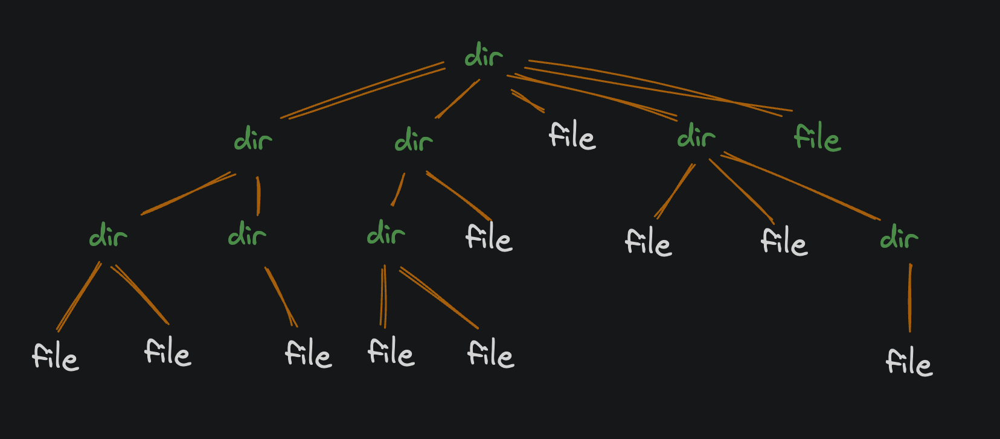

### Work done by <span style="color:#ECAD35">Sara Eilenstine</span>, course and media are through <a href="https://www.boot.dev/">Boot.dev</a>!

<br>

# <span style="color:#0F77A5"><strong>Learning File Systems</strong></span>

# WHAT IS A FILESYSTEM?

All the data stored on your computer is organized into files and directories. Files and directories are organized into a tree-like structure called a filesystem.



- Directories (same as "folders" on Windows) are just containers that hold files and other directories.
- Files are just a dump of raw binary data: 1's and 0's. The bytes in a file can represent anything: text, images, videos, etc.

The filesystem tree starts with a single directory called the root directory. The <a href="https://en.wikipedia.org/wiki/Root_directory">root directory</a> contains files and directories, which can contain more files and directories, and so on.

When you open your terminal, your working directory (the one you're "in") is going to be... somewhere. Most commonly it is your <a href="https://en.wikipedia.org/wiki/Home_directory">"home" directory</a>.

# <span style="color:#0F77A5"><strong>Assignment: NAVIGATING FILE SYSTEMS</strong></span>

You've just remotely logged onto a suspicious employee's machine at WorldBanc. First, you need to determine where on their filesystem you are...

Run the "print working directory" command to see the filepath of your current working directory:

```bash
pwd
```

- What is the first character of the path to your working directory?: `/`

# FILEPATHS

The output of your `pwd` command is a _filepath_. A filepath is a string that describes the location of a file or directory on your computer. Yours should look something like this:

```bash
/Users/wagslane
```

The text might be different, but the structure should be the same. Let's break it down:

- The first slash (`/`) represents the root directory. It's the tippy-top of the filesystem tree.
- The next part (`Users`) is the name of a directory inside the root directory.
- Finally, the last part (`wagslane`) is the name of a directory inside the `Users` directory.

So this path represents a directory 2 levels down from the root directory:

```bash
root
  └── Users
       └── wagslane
```

# <span style="color:#0F77A5"><strong>Assignment: FILE SYSTEMS CONTINUED</strong></span>

### Download the repo and make directory using following:

```bash
curl -L https://github.com/bootdotdev/worldbanc/archive/refs/heads/main.zip -o worldbanc.zip
unzip worldbanc.zip
rm worldbanc.zip
mv worldbanc-main worldbanc
sudo chown -R $(whoami) worldbanc
sudo chmod -R 755 worldbanc
```

- When entering `ls`, what does your screen say?

```bash
cattelia@Amaterasu: ls
README.md  go.mod  private  public
```

# PARENT DIRECTORIES

We talked about how you can "change directory" to move into a directory. But how do you move back out of a directory? The answer is two dots: `..`

```bash
cattelia@Amaterasu: cd ..
cattelia@Amaterasu: ls
README.md  go.mod  private  public
```

# ABSOLUTE FILE PATHS

### Work done by Sara Eilenstine, course is through <a href="https://www.boot.dev/">Boot.dev</a>!

<br>


