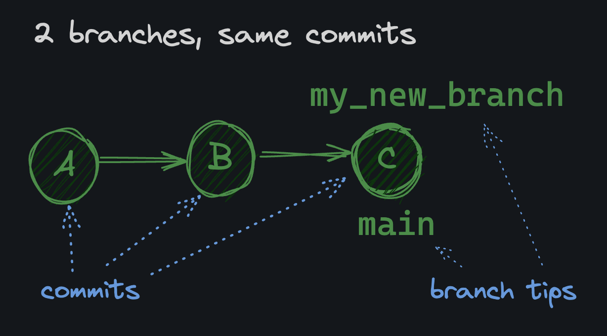

### Work done by <span style="color:#ECAD35">Sara Eilenstine</span>, course and media are through <a href="https://www.boot.dev/">Boot.dev</a>!

<br>

# WHAT IS A BRANCH?

A <a href="https://git-scm.com/book/en/v2/Git-Branching-Branches-in-a-Nutshell">Git branch</a> allows you to keep track of different changes separately.

### For Example:

Let's say you have a big web project and you want to experiment with changing the color scheme. Instead of changing the entire project directly (as of right now, our `master` branch), you can create a new branch called `color_scheme` and work on that branch. When you're done, if you like the changes, you can merge the `color_scheme` branch back into the `master` branch to keep the changes. If you don't like the changes, you can simply delete the `color_scheme` branch and go back to the `master` branch.

# UNDER THE HOOD

A branch is just a named <a href="https://en.wikipedia.org/wiki/Pointer_(computer_programming)#:~:text=A%20pointer%20is%20a%20programming,than%20storing%20the%20data%20itself.">pointer</a> to a specific commit. When you create a branch, you are creating a new pointer to a specific commit. The commit that the branch points to is called the tip of the branch. Because a branch is just a pointer to a commit, they're lightweight and "cheap" resource-wise to create. When you create 10 branches, you're not creating 10 copies of your project on your hard drive.


### TIP

// _Remember, you should be on `master` because we set `init.defaultBranch` to `master` at the start of the course._

```bash
cattelia@Amaterasu:~/webflyx$ git branch
* master

# Send test packages
cattelia@Amaterasu:~/webflyx$ bootdev run 8b4b9cd5-af15-4d71-b790-299fd2150a93
╭─────────────────────╮
│ Running: git branch │
╰┬────────────────────╯
 ├─  ?  Expect exit code 0
 ├─  ?  Expect stdout to contain all of:
 │       - 'master'

 > Command exit code: 0
 > Command stdout:

* master
cattelia@Amaterasu:~/webflyx$ bootdev submit 8b4b9cd5-af15-4d71-b790-299fd2150a93
╭────────────────────────╮
│ ✓  Running: git branch │
╰┬───────────────────────╯
 ├─  ✓  Expect exit code 0
 ├─  ✓  Expect stdout to contain all of:
 │       - 'master'


All tests passed! 🎉

Return to your browser to continue with the next lesson.
```

# DEFAULT BRANCH

We've been using </a href="https://git-scm.com/">Git's</a> default `master` branch. Interestingly, GitHub (a website where you can remotely store Git projects) recently changed its default branch from `master` to `main`. As a general rule, I recommend using `main` as your default branch if you work primarily with `GitHub`, as we will.

### How to Rename a Branch:

```bash
git branch -m oldname newname
```

### ASSIGNMENT

Change your global Git configuration to use `main` as the default branch. Change the `init.defaultBranch` key to `main`.

```bash
# Notice how "init" has been set to master
cattelia@Amaterasu:~/webflyx$ cat ~/.gitconfig
"[init]
        defaultBranch = master"
cattelia@Amaterasu:~/webflyx$ nano ~/.gitconfig
# After we change the global Git config
cattelia@Amaterasu:~/webflyx$ cat ~/.gitconfig
"[init]
        defaultBranch = main"
# Notice though that I'm still on `master`.
# That's because all I did was change the default branch for new repositories.
cattelia@Amaterasu:~/webflyx$ git branch
* master
# Switch _this_ repo to use `main`
cattelia@Amaterasu:~/webflyx$ git branch -m master main
cattelia@Amaterasu:~/webflyx$ git branch
* main

# Send test packages
cattelia@Amaterasu:~/webflyx$ bootdev run 34d03c25-be7c-4f27-84a4-2c98f2a752ed
╭───────────────────────────────────────────────────────╮
│ Running: git config --global --get init.defaultBranch │
╰┬──────────────────────────────────────────────────────╯
 ├─  ?  Expect exit code 0
 ├─  ?  Expect stdout to contain all of:
 │       - 'main'

 > Command exit code: 0
 > Command stdout:

main
╭─────────────────────╮
│ Running: git branch │
╰┬────────────────────╯
 ├─  ?  Expect exit code 0
 ├─  ?  Expect stdout to contain all of:
 │       - '* main'

 > Command exit code: 0
 > Command stdout:

* main
cattelia@Amaterasu:~/webflyx$ bootdev submit 34d03c25-be7c-4f27-84a4-2c98f2a752ed
╭──────────────────────────────────────────────────────────╮
│ ✓  Running: git config --global --get init.defaultBranch │
╰┬─────────────────────────────────────────────────────────╯
 ├─  ✓  Expect exit code 0
 ├─  ✓  Expect stdout to contain all of:
 │       - 'main'
╭────────────────────────╮
│ ✓  Running: git branch │
╰┬───────────────────────╯
 ├─  ✓  Expect exit code 0
 ├─  ✓  Expect stdout to contain all of:
 │       - '* main'


All tests passed! 🎉

Return to your browser to continue with the next lesson.
```

# VISUALIZING BRANCHES

Throughout the rest of this course, we will use text to represent branches and commits. For example:

```bash
A - B - C  main
```

means a branch called `main` with 3 commits. `C` is the most recent commit (the tip), `B` is the previous commit, and `A` is the commit before that.

To represent multiple branches, we'll use multiple lines:

```bash
    D - E  other_branch
  /
A - B - C  main
```

### Answer questions based on this diagram

```bash
       G - H    lanes_branch
      /
A - B - C - D   main
  \
   E - F        primes_branch

# Which commits are part of lanes_branch?
A, B, G, H

# Which commits are part of main?
A, B, C, D

# Which commits are part of primes_branch?
A, E, F
```

# NEW BRANCH

You should already be on the `main` branch: your "default" branch. You can always check with `git branch`.

## Two ways to create a branch

```bash
git branch my_new_branch
```

This creates a new branch called `my_new_branch`. The thing is, I (Boot.Dev Lane) rarely use this command because usually I want to create a branch and switch to it immediately.

So instead I use the <a href="https://git-scm.com/docs/git-switch">switch</a> command with a `-c` flag, where `c` tells git to create a new branch if it does not already exist:

```bash
git switch -c my_new_branch
```

When you create a new branch, it uses the _current commit_ you are on as the branch base. For example, if you're on your main branch with 3 commits, `A`, `B`, and `C`, and then you run `git switch -c my_new_branch`, your new branch will look like this:



```bash
# Notice that there is only one branch
cattelia@Amaterasu:~/webflyx$ git branch
* main
# Create a switch to the new branch
cattelia@Amaterasu:~/webflyx$ git switch -c add_classics
Switched to a new branch 'add_classics'
# Notice the astreks (*) moved to `add_classics`
cattelia@Amaterasu:~/webflyx$ git branch
* add_classics
  main

# Send test packages
cattelia@Amaterasu:~/webflyx$ bootdev run 02f31255-f521-4317-946a-a8a9ca67e7cf
╭─────────────────────╮
│ Running: git branch │
╰┬────────────────────╯
 ├─  ?  Expect exit code 0
 ├─  ?  Expect stdout to contain all of:
 │       - '* add_classics'
 │       - 'main'

 > Command exit code: 0
 > Command stdout:

* add_classics
  main
cattelia@Amaterasu:~/webflyx$ bootdev submit 02f31255-f521-4317-946a-a8a9ca67e7cf
╭────────────────────────╮
│ ✓  Running: git branch │
╰┬───────────────────────╯
 ├─  ✓  Expect exit code 0
 ├─  ✓  Expect stdout to contain all of:
 │       - '* add_classics'
 │       - 'main'


All tests passed! 🎉

Return to your browser to continue with the next lesson.
```

# SWITCHING BRANCHES

We talked about using <a href="https://git-scm.com/docs/git-switch">git switch</a> to change branches. There's another command that you'll certainly run into because it's been around for a long time and older developers are used to it: `git checkout`. `git switch` is a newer command that is meant to be more intuitive and user-friendly. It's recommended to use `git switch` over `git checkout` for simply switching branches.

To switch to a branch called prime:

```bash
git switch prime

# or, the old way:
git checkout prime
```

Try it myself:

```bash
# Where I started
cattelia@Amaterasu:~/webflyx$ git branch
* add_classics
  main
# Switch to main
cattelia@Amaterasu:~/webflyx$ git switch main
Switched to branch 'main'
# Where I am at
cattelia@Amaterasu:~/webflyx$ git branch
  add_classics
* main
# Switch back to add_classics
cattelia@Amaterasu:~/webflyx$ git switch add_classics
Switched to branch 'add_classics'
# Where I ended
cattelia@Amaterasu:~/webflyx$ git branch
* add_classics
  main

# Send test packages
cattelia@Amaterasu:~/webflyx$ bootdev run 7b1f541b-a333-4ac0-8317-8165530c0998
╭─────────────────────╮
│ Running: git branch │
╰┬────────────────────╯
 ├─  ?  Expect exit code 0
 ├─  ?  Expect stdout to contain all of:
 │       - '* add_classics'
 │       - 'main'

 > Command exit code: 0
 > Command stdout:

* add_classics
  main
cattelia@Amaterasu:~/webflyx$ bootdev submit 7b1f541b-a333-4ac0-8317-8165530c0998
╭────────────────────────╮
│ ✓  Running: git branch │
╰┬───────────────────────╯
 ├─  ✓  Expect exit code 0
 ├─  ✓  Expect stdout to contain all of:
 │       - '* add_classics'
 │       - 'main'


All tests passed! 🎉

Return to your browser to continue with the next lesson.
```

# UPLEVELING MY ABILITIES

We'll use the `add_classics` branch to add a commit to the project without affecting the `main` branch. Add a new file to this branch.

```bash
# Starting in `add_classics` branch
cattelia@Amaterasu:~/webflyx$ git branch
* add_classics
  main
# What is in here
cattelia@Amaterasu:~/webflyx$ ls
contents.md  quotes  titles.md
cattelia@Amaterasu:~/webflyx$ nano classics.csv
"title, director, year
One Crazy Summer, Savage Steve Holland, 1986
The Princess Bride, Rob Reiner, 1987
The Goonies, Richard Donner, 1985
The Breakfast Club, John Hughes, 1985
Monty Python and the Holy Grail, Terry Gilliam, 1975"
# See a new file has been addded
cattelia@Amaterasu:~/webflyx$ ls
classics.csv  contents.md  quotes  titles.md
# Stage for commiting to the branch
cattelia@Amaterasu:~/webflyx$ git add ./classics.csv
cattelia@Amaterasu:~/webflyx$ git status
On branch add_classics
Changes to be committed:
  (use "git restore --staged <file>..." to unstage)
        #new file:   classics.csv
# Commit to `add_classics` branch
cattelia@Amaterasu:~/webflyx$ git commit -m "D: add classics.csv"
[add_classics 2df649c] D: add classics.csv
 1 file changed, 6 insertions(+)
 create mode 100644 classics.csv
cattelia@Amaterasu:~/webflyx$ git log
# commit 2df649cbd7f966499baf93b41d080215f4da6926 (HEAD -> add_classics)
Author: Sara <cattelia@gmail.com>
Date:   Tue Jun 18 11:36:41 2024 -0700

    D: add classics.csv

commit f3a8dab1f0d34411b01f44beb5048c8087c5c3f6 (main)
Author: Sara <cattelia@gmail.com>
Date:   Fri Jun 14 13:49:11 2024 -0700

    C: add quotes

commit f576ca142afcec2b8485d8fd5729d20b3138c320
Author: Sara <cattelia@gmail.com>
Date:   Fri Jun 14 13:28:20 2024 -0700

    B: add titles

commit 2eba3e15e5d39122e6e5b9c3a8dce8eaa54d0af5
Author: Sara <cattelia@gmail.com>
Date:   Fri Jun 14 00:32:57 2024 -0700

    A: add contents.md

# Send test packages
cattelia@Amaterasu:~/webflyx$ bootdev run da54c8cb-2b06-45ab-b8bb-157bc2446432
╭──────────────────────────────────╮
│ Running: git --no-pager log -n 5 │
╰┬─────────────────────────────────╯
 ├─  ?  Expect exit code 0
 ├─  ?  Expect stdout to contain all of:
 │       - 'D:'

 > Command exit code: 0
 > Command stdout:

commit 2df649cbd7f966499baf93b41d080215f4da6926
Author: Sara <cattelia@gmail.com>
Date:   Tue Jun 18 11:36:41 2024 -0700

    D: add classics.csv

commit f3a8dab1f0d34411b01f44beb5048c8087c5c3f6
Author: Sara <cattelia@gmail.com>
Date:   Fri Jun 14 13:49:11 2024 -0700

    C: add quotes

commit f576ca142afcec2b8485d8fd5729d20b3138c320
Author: Sara <cattelia@gmail.com>
Date:   Fri Jun 14 13:28:20 2024 -0700

    B: add titles

commit 2eba3e15e5d39122e6e5b9c3a8dce8eaa54d0af5
Author: Sara <cattelia@gmail.com>
Date:   Fri Jun 14 00:32:57 2024 -0700

    A: add contents.md
╭─────────────────────╮
│ Running: git branch │
╰┬────────────────────╯
 ├─  ?  Expect exit code 0
 ├─  ?  Expect stdout to contain all of:
 │       - '* add_classics'

 > Command exit code: 0
 > Command stdout:

* add_classics
  main
cattelia@Amaterasu:~/webflyx$ bootdev submit da54c8cb-2b06-45ab-b8bb-157bc2446432
╭─────────────────────────────────────╮
│ ✓  Running: git --no-pager log -n 5 │
╰┬────────────────────────────────────╯
 ├─  ✓  Expect exit code 0
 ├─  ✓  Expect stdout to contain all of:
 │       - 'D:'
╭────────────────────────╮
│ ✓  Running: git branch │
╰┬───────────────────────╯
 ├─  ✓  Expect exit code 0
 ├─  ✓  Expect stdout to contain all of:
 │       - '* add_classics'


All tests passed! 🎉

Return to your browser to continue with the next lesson.
```

# LOG FLAGS

Remember, `git log` shows us the history of commits in the repo. There are a few flags you can use

- `short` - default
- `full` - shows the full ref name
- `no` - no decoration

```bash
# no
cattelia@Amaterasu:~/webflyx$ git log --decorate=no
commit 2df649cbd7f966499baf93b41d080215f4da6926
Author: Sara <cattelia@gmail.com>
Date:   Tue Jun 18 11:36:41 2024 -0700

    D: add classics.csv

# short
cattelia@Amaterasu:~/webflyx$ git log --decorate=short
commit 2df649cbd7f966499baf93b41d080215f4da6926 (HEAD -> add_classics)
Author: Sara <cattelia@gmail.com>
Date:   Tue Jun 18 11:36:41 2024 -0700

    D: add classics.csv

# full
cattelia@Amaterasu:~/webflyx$ git log --decorate=full
commit 2df649cbd7f966499baf93b41d080215f4da6926 (HEAD -> refs/heads/add_classics)
Author: Sara <cattelia@gmail.com>
Date:   Tue Jun 18 11:36:41 2024 -0700

    D: add classics.csv

# --oneline + --decorate
cattelia@Amaterasu:~/webflyx$ git log --oneline --decorate=full
2df649c (HEAD -> refs/heads/add_classics) D: add classics.csv
```

# GIT FILES

Remember, Git stores all its information in files in the `.git` subdirectory at the root of your project, even information about branches. The "heads" (or "tips") of branches are stored in the `.git/refs/heads` directory. If you `cat` one of the files in that directory, you should be able to see the commit hash that the branch points to.

```bash
# Switch to main
cattelia@Amaterasu:~/webflyx$ git switch main
Switched to branch 'main'
cattelia@Amaterasu:~/webflyx$ git branch
  add_classics
* main
cattelia@Amaterasu:~/webflyx$ cd .git/refs/heads
cattelia@Amaterasu:~/webflyx/.git/refs/heads$ ls
add_classics  main
cattelia@Amaterasu:~/webflyx/.git/refs/heads$ cat add_classics
# 2df649cbd7f966499baf93b41d080215f4da6926
cattelia@Amaterasu:~/webflyx/.git/refs/heads$ cat main
# f3a8dab1f0d34411b01f44beb5048c8087c5c3f6

# What is stored in .git/refs/heads?
One file for each branch, containing the commit has that the branch points to.
```

---

### Work done by <span style="color:#ECAD35">Sara Eilenstine</span>, course and media are through <a href="https://www.boot.dev/">Boot.dev</a>!

<br>


