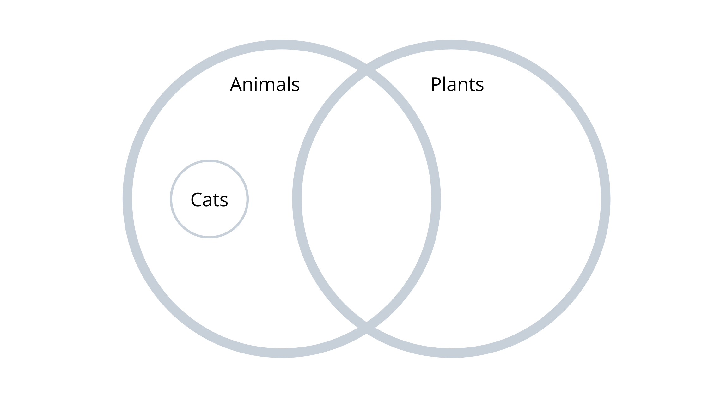
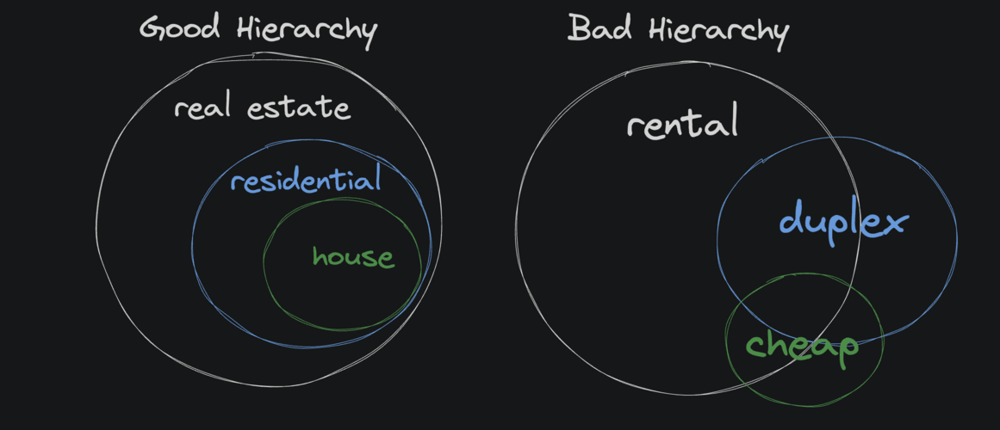
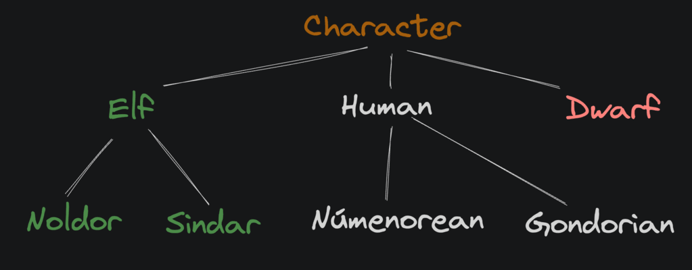
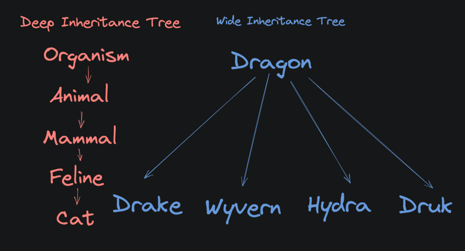
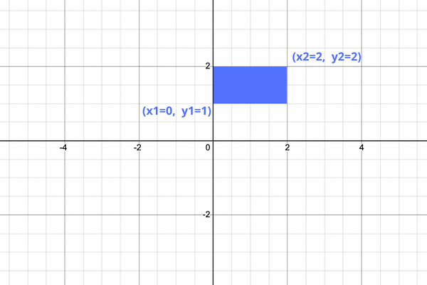
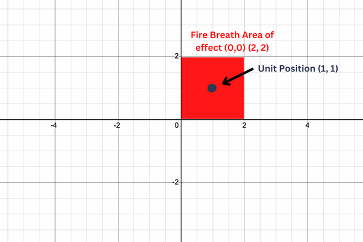

### Work done by <span style="color:#ECAD35">Sara Eilenstine</span>, course and media are through <a href="https://www.boot.dev/">Boot.dev</a>!

<br>

# INHERITANCE

We've made it to the holy grail of object-oriented programming: <a href="https://en.wikipedia.org/wiki/Inheritance_(object-oriented_programming)">inheritance</a>. Non-OOP languages like Go and Rust allow for encapsulation and abstraction features as nearly every language does. Inheritance, on the other hand, tends to be unique to class-based languages like Python, Java, and Ruby.

## WHAT IS INHERITANCE?

Inheritance allows one class, the "child" class, to _inherit_ the properties and methods of another class, the "parent" class.

For example:
Here `Cow` is a "child" class that inherits from the "parent" class `Animal`:

```python
class Animal:
    # parent "Animal" class

class Cow(Animal):
    # child class "Cow" inherits "Animal"
```

The `Cow` class can reuse the `Animal` class's constructor with the <a href="https://docs.python.org/3/library/functions.html#super">super()</a> method:

```python
class Animal:
    def __init__(self, num_legs):
        self.num_legs = num_legs

class Cow(Animal):
    def __init__(self):
        # call the parent constructor to
        # give the cow some legs
        super().__init__(4)
```

# <span style="color:#0F77A5"><strong>Assignment</strong></span>

In Age of Dragons, all the archers are humans, but not all humans are necessarily archers. All humans have a `name`, but only archers have a `__num_arrows` property.

Complete the `Archer` class. It should inherit the `Human` class. In its constructor it should call its parent's constructor, then also set its unique `__num_arrows` property.

```python
class Human:
    def __init__(self, name):
        self.__name = name

    def get_name(self):
        return self.__name


## don't touch above this line


class Archer(Human):
    def __init__(self, name, num_arrows):
        # Coming from Human > __init__(self, name)
        self.name = super().__init__(name)
        # Standard private variable assignment
        self.__num_arrows = num_arrows

    def get_num_arrows(self):
        return self.__num_arrows
```

# WHEN SHOULD I USE INHERITANCE?

Inheritance is a powerful tool, but it is a really bad idea to try to overuse it. Inheritance should only be used when all instances of a child class are also instances of the parent class.

When a child class inherits from a parent, it inherits **_everything_**. If you only want to share some functionality, inheritance is probably not the best answer. Better to simply share some functions, or maybe make a new parent class that both classes can inherit from.

**All cats are animals but not all animals are cats**


# INHERITANCE HIERARCHY

There is no limit to how deeply we can nest an inheritance tree. For example, a `Cat` can inherit from an `Animal` that inherits from `LivingThing`. That said, be careful! _New programmers often get carried away._

You should never think to yourself:

```
"Well most wizards are elves... so I'll just have wizard inherit from elf"
```

A good child class is a strict <a href="https://en.wikipedia.org/wiki/Subset">subset</a> of its parent class.

# <span style="color:#0F77A5"><strong>Assignment</strong></span>

Let's add a new game unit: `Crossbowman`. A crossbowman is always an archer, but not all archers are crossbowmen. Crossbowmen have several arrows, but they have an additional method: `triple_shot()`.

1. Add a `use_arrows(self, num)` method to the `Archer` class. It should remove `num` arrows. If there aren't enough arrows to remove, it should raise a `not enough arrows` exception.
2. The `Crossbowman` class's constructor should call its parent's constructor.
3. The crossbowman's `triple_shot` method should use `3` arrows.
4. The crossbowman's `triple_shot` method takes a target as a parameter and returns `{} was shot by 3 crossbow bolts` where `{}` is the name of the `Human` that was shot.

```python
class Human:
    def __init__(self, name):
        self.__name = name

    def get_name(self):
        return self.__name

class Archer(Human):
    def __init__(self, name, num_arrows):
        super().__init__(name)
        self.__num_arrows = num_arrows

    def get_num_arrows(self):
        return self.__num_arrows
## don't touch above this line


    def use_arrows(self, num):
        if self.__num_arrows < num:
            raise Exception("not enough arrows")
        self.__num_arrows -= num


class Crossbowman(Archer):
    def __init__(self, name, num_arrows):
        super().__init__(name, num_arrows)

    def triple_shot(self, target):
        super().use_arrows(3)
        # Support from git repo comment: https://github.com/UCLL-PR2/exercises/issues/32
        return f"{target.get_name()} was shot by 3 crossbow bolts"
```

I was attempting to just call `target.__name` inside of `def triple_shot()` but it returned the error, `Unexpected exception: 'Archer' object has no attribute '_Crossbowman__name'`. This is because the `.__name` is inherited all the way up to `Human` parent class, which has a getter function, `get_name`.

# REVIEW

### Inheritance needs to encapsule **all** of the characterstics of the parent, not just some.



### Example of inheritance in code:

```python
class RealEstate:
    def __init__(self, location):
        self.__location = location


class Residential(RealEstate):
    def __init__(self, location, bedrooms):
        super().__init__(location)
        self.__bedrooms = bedrooms


class House(Residential):
    def __init__(self, location, bedrooms, yard_size):
        super().__init__(location, bedrooms)
        self.__yard_size = yard_size
```

# MULTIPLE CHILDREN

So far we've worked with linear class inheritance, but usually, inheritance hierarchies form trees, not lines. A parent class can have multiple children.



# <span style="color:#0F77A5"><strong>Assignment: ARCHER</strong></span>

The `Archer` class should inherit from `Hero`. Fulfill the following requirements from the game designers:

- `Archer` should inherit from `Hero`
- `Archer` should set up the hero's name and health
- Set a private "number of arrows" variable that can be passed in as a third parameter to the constructor.
- Create a `shoot` method that takes a target hero as input. If there are no arrows left, raise a `not enough arrows` exception. Otherwise, remove an arrow and deal `10` damage to the target hero.

```python
class Hero:
    def __init__(self, name, health):
        self.__name = name
        self.__health = health

    def get_name(self):
        return self.__name

    def get_health(self):
        return self.__health

    def take_damage(self, damage):
        self.__health -= damage


class Archer(Hero):
    def __init__(self, name, health, num_arrows):
        super().__init__(name, health)
        self.__num_arrows = num_arrows

    def shoot(self, target):
        if self.__num_arrows <= 0:
            raise Exception("not enough arrows")
        self.__num_arrows -= 1
        target.take_damage(10)
```

# <span style="color:#0F77A5"><strong>Assignment: WIZARD</strong></span>

Let's extend the Hero class by adding a second child class: the Wizard. Wizard heroes are more powerful than archer heroes. They cast spells at other heroes instead of shooting them, and casting does 25 damage instead of 10 but also costs 25 mana.

Fulfill the following requirements.

- `Wizard` should inherit from Hero
- `Wizard` should set up the hero's name and health
- Set a private "mana" variable that can be passed in as a third parameter to the constructor.
- Create a `cast` method that takes a target hero as input. If there is not enough mana left, raise a `not enough mana` exception. Otherwise, remove `25` mana from the wizard and deal `25` damage to the target hero.

```python
# From earlier work
class Hero:
    def __init__(self, name, health):
        self.__name = name
        self.__health = health

    def get_name(self):
        return self.__name

    def get_health(self):
        return self.__health

    def take_damage(self, damage):
        self.__health -= damage


class Archer(Hero):
    def __init__(self, name, health, num_arrows):
        super().__init__(name, health)
        self.__num_arrows = num_arrows

    def shoot(self, target):
        if self.__num_arrows <= 0:
            raise Exception("not enough arrows")
        self.__num_arrows -= 1
        target.take_damage(10)

# Figure this out
class Wizard(Hero):
    def __init__(self, name, health, mana):
        # Inherit the name and health from Hero parent
        super().__init__(name, health)
        # initialize private `mana` variable
        self.__mana = mana

    def cast(self, target):
        # The cost of a mana spell is 25
        if self.__mana < 25:
            raise Exception("not enough mana")
        self.__mana -= 25
        target.take_damage(25)
```

# INHERITANCE BUILD REVIEW

You'll often find that it's more likely that an inheritance tree is wide than deep. In other words, instead of a deep tree like:


### WHY ARE INHERITANCE TREES OFTEN WIDE INSTEAD OF DEEP?

As we talked about earlier, in good software a child class is a strict subset of its parent class. In a deep tree, that means the children need to be perfect members of all the parent class "types". That simply doesn't happen very often in the real world. It's much more likely that you'll have a base class that simply has many sibling classes that are slightly different variations of the base.

# <span style="color:#0F77A5"><strong>Assignment: DRAGONS</strong></span>

In "Age of Dragons", there are Orcs, Humans, Goblins, Dragons, etc. All of those different creatures are called "units". At the moment, the only thing specific to a unit is that it has a `position` on the game map and a `name`.

Dragons, a specific type of unit, can breathe fire in a large area dealing damage to any units that are touched by its fiery blaze.

## THE GAME GRID

Our game map is just a <a href="https://en.wikipedia.org/wiki/Cartesian_coordinate_system">Cartesian plane</a>.


<br>

Complete the unit's `in_area` method and the dragon's `breathe_fire` method.

### `IN_AREA`

This method has four parameters, `x_1`, `y_1`, `x_2` and `y_2`. Where `x_1` and `y_1` make up the bottom-left point of the rectangle and `x_2` and `y_2` define the top-right point.

Use the unit's `pos_x` and `pos_y` to determine if it is inside or touching the rectangle, if so, return `True`. Otherwise, return `False`.

### `BREATH_FIRE`

This method causes the dragon to breathe a swath of fire in the target area. The target area is centered at `(x,y)`. The area stretches for `__fire_range` in both directions inclusively.

For each unit in the `units` list, append that unit to a list if the unit is within the blast. `Return` the list of units hit by the blast.

### EXAMPLE OF FIRE BREATHING HITTING A UNIT

The example above uses a `__fire_range` of `1` centered at `(1, 1)`.



<br>

```python
class Unit:
    def __init__(self, name, pos_x, pos_y):
        self.name = name
        self.pos_x = pos_x
        self.pos_y = pos_y

    def in_area(self, x_1, y_1, x_2, y_2):
        pass


class Dragon(Unit):
    def __init__(self, name, pos_x, pos_y, fire_range):
        super().__init__(name, pos_x, pos_y)
        self.__fire_range = fire_range

    def breathe_fire(self, x, y, units):
        pass

```

### Work done by <span style="color:#ECAD35">Sara Eilenstine</span>, course and media are through <a href="https://www.boot.dev/">Boot.dev</a>!

<br>


