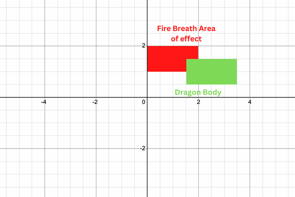
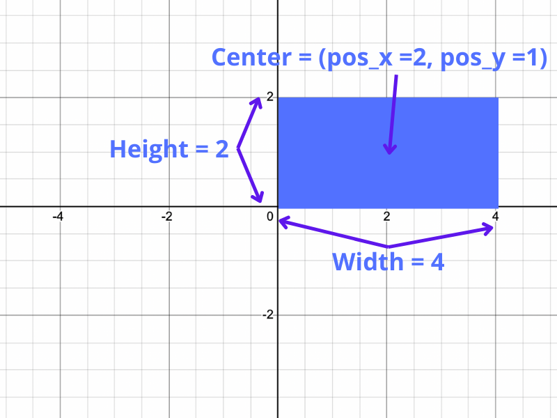

# <div align="center">Polymorphism</div>

### Work done by <span style="color:#ECAD35">Sara Eilenstine</span>, course and media are through <a href="https://www.boot.dev/">Boot.dev</a>!

<br>

# WHAT IS POLYMORPHISM?

While inheritance is the most unique trait of object-oriented languages, polymorphism is probably the most powerful. Polymorphism is the ability of a variable, function or object to take on multiple forms.

- "poly"="many"
- "morph"="form"

For example, classes in the same hierarchical tree may have methods with the same name but different behaviors.

## SHAPES

Let's look at a simple example.

```python
class Creature():
    def move(self):
        print("the creature moves")

class Dragon(Creature):
    def move(self):
        print("the dragon flies")

class Kraken(Creature):
    def move(self):
        print("the kraken swims")

for creature in [Creature(), Dragon(), Kraken()]:
    creature.move()
# prints:
# the creature moves
# the dragon flies
# the kraken swims
```

The `Dragon` and `Kraken` child classes are overriding the behavior of their parent class's `move()` method.

# <span style="color:#0F77A5"><strong>Assignment</strong></span>

We're going to build hit-box logic for our game step by step, starting with a simple `Rectangle`.

Take a look at the test cases in `main_test.py` to see how it's expected to behave. Complete the `__init__()` method. Variables should be passed into the constructor in this order:

1. x1
2. y1
3. x2
4. y2

```python
class Rectangle:
    def __init__(self, x1, y1, x2, y2):
        self.x1 = x1
        self.y1 = y1
        self.x2 = x2
        self.y2 = y2
```

# <span style="color:#0F77A5"><strong>Assignment: GET EDGES</strong></span>

Remember that with normal "units" we were checking if their (x/y) point was within a rectangle (the Dragon's breath) to see if they were hit by the fire. With a dragon, because they're so big, we're going to check if the dragon's body (a rectangle) is within the fire (also a rectangle still). The image below contains an example of fire breath hitting a dragon.



In the next assignment, we'll be writing the overlap method itself. The coordinates have been made private members. First, let's set up some helper methods.

Write the following methods. What they do should be self-explanatory given their names.

- `get_left_x()`
- `get_right_x()`
- `get_top_y()`
- `get_bottom_y()`

Remember that `x1` OR `x2` could be the "left x" based on its value on the Cartesian plane. The same goes for the `y` values. You may find Python's built-in `min` and `max` functions useful if you'd rather not use the comparison operators.

### Note:

// _`__repr__()` will be explained later in this chapter._

```python
class Rectangle:
    def __init__(self, x1, y1, x2, y2):
        self.__x1 = x1
        self.__y1 = y1
        self.__x2 = x2
        self.__y2 = y2

    def get_left_x(self):
        return self.__x1 if self.__x1 < self.__x2 else self.__x2
        #return min(self.__x1, self.__x2)

    def get_right_x(self):
        return self.__x1 if self.__x1 > self.__x2 else self.__x2
        #return max(self.__x1, self.__x2)

    def get_top_y(self):
        return self.__y1 if self.__y1 > self.__y2 else self.__y2
        #return max(self.__y1, self.__y2)

    def get_bottom_y(self):
        return self.__y1 if self.__y1 < self.__y2 else self.__y2
        #return min(self.__y1, self.__y2)

    def __repr__(self):
        return f"Rectangle({self.__x1}, {self.__y1}, {self.__x2}, {self.__y2})"
```

# <span style="color:#0F77A5"><strong>Assignment: CHECK IF RECTANGLES OVERLAP</strong></span>

Let's write the `overlaps()` method. It should check if this rectangle overlaps a given rectangle, rect. Return `True` if this rectangle overlaps any part of rect, including just touching sides, or `False` otherwise.

Here are four conditions that must be `True` if this rectangle (A) overlaps or touches `rect` (B):

- A's left side is on or to the left of B's right side
- A's right side is on or to the right of B's left side
- A's top side is on or above B's bottom side
- A's bottom side is on or below B's top side

```python
# This is... absolutely wrong.
class Rectangle:
    def overlaps(self, rect):
        if self.get_left_x() <= rect.get_left_x() == True:
            if self.get_right_x() >= rect.get_right_x() == True:
                if self.get_top_y() >= rect.get_top_y() == True:
                    if self.get_bottom_y() <= rect.get_bottom_y() == True:
                        return True

        else:
            return False

    # From my earlier work, do not need to touch anything under here.
    def __init__(self, x1, y1, x2, y2):
        self.__x1 = x1
        self.__y1 = y1
        self.__x2 = x2
        self.__y2 = y2

    def get_left_x(self):
        return self.__x1 if self.__x1 < self.__x2 else self.__x2

    def get_right_x(self):
        return self.__x1 if self.__x1 > self.__x2 else self.__x2

    def get_top_y(self):
        return self.__y1 if self.__y1 > self.__y2 else self.__y2

    def get_bottom_y(self):
        return self.__y1 if self.__y1 < self.__y2 else self.__y2

    def __repr__(self):
        return f"Rectangle({self.__x1}, {self.__y1}, {self.__x2}, {self.__y2})"

```

### As we can see, this code is not working:

```python
class Rectangle:
    def overlaps(self, rect):
        if self.get_left_x() <= rect.get_left_x() == True:
            if self.get_right_x() >= rect.get_right_x() == True:
                if self.get_top_y() >= rect.get_top_y() == True:
                    if self.get_bottom_y() <= rect.get_bottom_y() == True:
                        return True

        else:
            return False
```

I thought I would be clever and have nesting if statements but there are multiple problems:

1. The comparison operations are not even pointing at the right section
2. There are no break points for when any of these if-statements do Fail
3. Comparing the boolean operator to then compare if the outcome is `True` causes issues as each operator can be `True` or `False`

I then played around in `dragons_test.py` to try to figure out what was going on. I got to the working code:

```python
class Rectangle:
    def overlaps(self, rect):
        if self.get_left_x() <= rect.get_right_x():
            print("True left is on or let of right")
        else:
            print("False")
            return False

        if self.get_right_x() >= rect.get_left_x():
            print("True right is on or right of left")
        else:
            print("False")
            return False

        if self.get_top_y() >= rect.get_bottom_y():
            print("True top is on or above bottom")
        else:
            print("False")
            return False

        if self.get_bottom_y() <= rect.get_top_y():
            print("True bottom is on or below top")
        else:
            print("False")
            return False

# Got help from: https://stackoverflow.com/questions/70019696/python-stopping-on-first-if-condition
```

This took many tries and after trying to understand what was happening from the top code. Like, why doesn't my code go into the next if-statement? Why arent they catching the right x's and y's? And so on.

### I came to the solution. Use a flag:

```python
    value = True

    if self.get_left_x() <= rect.get_right_x():
        value = True
    else:
        return False

    if self.get_right_x() >= rect.get_left_x():
        value = True
    else:
        return False

    if self.get_top_y() >= rect.get_bottom_y():
        value = True
    else:
        return False

    if self.get_bottom_y() <= rect.get_top_y():
        value = True
    else:
        return False

    return value
```

I didn't like how long this was so I wanted to condense it and got a nested if-statements. And I figured out how to make this work, I also did not like this. Which led to the `# ALTERNATE CODE` which is much, much prettier.

```python
class Rectangle:
    def overlaps(self, rect):
        value = True

        if self.get_left_x() <= rect.get_right_x():
            value = True
            if self.get_right_x() >= rect.get_left_x():
                value = True
                if self.get_top_y() >= rect.get_bottom_y():
                    value = True
                    if self.get_bottom_y() <= rect.get_top_y():
                        value = True
                    else:
                        return False
                else:
                    return False
            else:
                return False
        else:
            return False

        return value
    # don't touch below this line

    def __init__(self, x1, y1, x2, y2):
        self.__x1 = x1
        self.__y1 = y1
        self.__x2 = x2
        self.__y2 = y2

    def get_left_x(self):
        if self.__x1 < self.__x2:
            return self.__x1
        return self.__x2

    def get_right_x(self):
        if self.__x1 > self.__x2:
            return self.__x1
        return self.__x2

    def get_top_y(self):
        if self.__y1 > self.__y2:
            return self.__y1
        return self.__y2

    def get_bottom_y(self):
        if self.__y1 < self.__y2:
            return self.__y1
        return self.__y2

    def __repr__(self):
        return f"Rectangle({self.__x1}, {self.__y1}, {self.__x2}, {self.__y2})"

# ALTERNATE much better CODE

class Rectangle:
    def overlaps(self, rect):
        return (
            self.get_left_x() <= rect.get_right_x()
            and self.get_right_x() >= rect.get_left_x()
            and self.get_top_y() >= rect.get_bottom_y()
            and self.get_bottom_y() <= rect.get_top_y()
        )
    .
    .
    .
```

# BRINGING IT ALL TOGETHER IN `DRAGONS` CLASS

# <span style="color:#0F77A5"><strong>Assignment</strong></span>

Let's bring all we've done together in the `Dragon` class. The `Dragon` class should override the Unit class's in_area method. Instead of checking if the center position of the Dragon is in the given area, we'll check if its big dragon body overlaps with the given area.

### Complete `.__hit_box`

First, complete the Dragon's constructor. The dragon needs one more private data member: `__hit_box`. The hitbox is a `Rectangle` object. You've been provided with the height, width, and center position (`pos_x`, `pos_y`) of the dragon.

### Example of `.__hit_box`



### `in_area()` Method

Next, you'll need to override the `in_area` method.

1. Create a new rectangle object with the given corner positions
2. Use the rectangle's overlaps method to check if the Dragon's `self.__hit_box` is inside it
3. This method should return a boolean value.

```python
class Unit:
    def __init__(self, name, pos_x, pos_y):
        self.name = name
        self.pos_x = pos_x
        self.pos_y = pos_y

    def in_area(self, x1, y1, x2, y2):
        # Good as is, we are overwriting.
        pass


class Dragon(Unit):
    def __init__(self, name, pos_x, pos_y, height, width, fire_range):
        # Inherited: self.name, self.pos_x, self.pos_y
        super().__init__(name, pos_x, pos_y)
        self.fire_range = fire_range
        self.height = height
        self.width = width

        # Rectange takes (x1, y1, x2, y2) which need to be calculated from pos_x, pos_y, height, and width
        x1 = self.pos_x - (self.width / 2)
        y1 = self.pos_y - (self.height / 2)
        x2 = self.pos_x + (self.width / 2)
        y2 = self.pos_y + (self.height / 2)

        self.__hit_box = Rectangle(x1, y1, x2, y2)

        # print(f"{self.name} hitbox is ({x1}, {y1}) to ({x2}, {y2})")

    def in_area(self, x1, y1, x2, y2):
        # Overlaps() => Dragon1.overlaps(Dragon2) >> True / False
        #print(f"Designated area ({x1}, {y1}) to ({x2}, {y2})")
        area = Rectangle(x1, y1, x2, y2)
        return area.overlaps(self.__hit_box)


# Work we have already done

class Rectangle:

    def __init__(self, x1, y1, x2, y2):
        self.__x1 = x1
        self.__y1 = y1
        self.__x2 = x2
        self.__y2 = y2

    def overlaps(self, rect):
        # Returns True or False
        return (
            self.get_left_x() <= rect.get_right_x()
            and self.get_right_x() >= rect.get_left_x()
            and self.get_top_y() >= rect.get_bottom_y()
            and self.get_bottom_y() <= rect.get_top_y()
        )

    def get_left_x(self):
        if self.__x1 < self.__x2:
            return self.__x1
        return self.__x2

    def get_right_x(self):
        if self.__x1 > self.__x2:
            return self.__x1
        return self.__x2

    def get_top_y(self):
        if self.__y1 > self.__y2:
            return self.__y1
        return self.__y2

    def get_bottom_y(self):
        if self.__y1 < self.__y2:
            return self.__y1
        return self.__y2
```

# POLYMORPHISM REVIEW

Take a look at the Greek roots of the word "polymorphism".

- "poly" means "many".
- "morph" means "to change" or "form".

Polymorphism in programming is the ability to present the same interface (function or method signatures) for many different underlying forms (data types).

A classic example is a `Shape` class that `Rectangle`, `Circle`, and `Triangle` can inherit from. With polymorphism, each of these classes will have different underlying data. The circle needs its center point coordinates and radius. The rectangle needs two coordinates for the top left and bottom right corners. The triangle needs coordinates for the corners.

By making each class responsible for its data and its code, you can achieve polymorphism. In the shapes example, each class would have its own `draw_shape()` method. This allows the code that uses the different shapes to be simple and easy, and more importantly, it can treat shapes as the same even though they are different. It hides the complexities of the difference behind a clean abstraction.

```python
shapes = [Circle(5, 5, 10), Rectangle(1, 3, 5, 6)]
for shape in shapes:
    print(shape.draw_shape())
```

This is in contrast to the functional way of doing things where you would have had separate functions that have different function signatures, like `draw_rectangle(x1, y1, x2, y2)` and `draw_circle(x, y, radius)`.

## WAIT, WHAT IS A _"FUNCTION SIGNATURE"_?

A function signature (or method signature) includes the name, inputs, and outputs of a function or method. For example, `hit_by_fire` in the `Human` and `Archer` classes have identical signatures.

```python
class Human:
    def hit_by_fire(self):
        self.health -= 5
        return self.health

class Archer:
    def hit_by_fire(self):
        self.health -= 10
        return self.health
```

Both methods have the same name, take `0` inputs, and return integers. If any of those things were different, they would have different function signatures.

Here is an example of different signatures:

```python
class Human:
    def hit_by_fire(self):
        self.health -= 5
        return self.health

class Archer:
    def hit_by_fire(self, dmg):
        self.health -= dmg
        return self.health
```

The `Archer` class's `hit_by_fire` method takes an input, `dmg`, which is used to calculate the new health. This is a different signature than the `Human` class's `hit_by_fire` method, which takes no inputs. Calling two methods with the same signature should look the same to the caller.

```python
# same inputs (none)
# same name
# same outputs (a single integer)
health = sam.hit_by_fire()
health = archer.hit_by_fire()
```

## WHEN OVERRIDING METHODS, USE THE SAME FUNCTION SIGNATURE

If you change the function signature of a parent class when overriding a method, it could be a disaster. The whole point of overriding a method is so that the caller of your code doesn't have to worry about what different things are going on inside the methods of different object types.

# OPERATOR OVERLOADING

Another kind of built-in polymorphism in Python is the ability to override how an operator works. For example, the + operator works for built-in types like integers and strings.

```python
print(3 + 4)
# prints "7"

print("three " + "four")
# prints "three four"
```

Custom classes on the other hand don't have any built-in support for those operators:

```python
class Point:
    def __init__(self, x, y):
        self.x = x
        self.y = y


p1 = Point(4, 5)
p2 = Point(2, 3)
p3 = p1 + p2
# TypeError: unsupported operand type(s) for +: 'Point' and 'Point'
```

However, we can add our own support! If we create an `__add__(self, other)` method on our class, the Python interpreter will use it when instances of the class are being added with the `+` operator. Here's an example:

```python
class Point:
    def __init__(self, x, y):
        self.x = x
        self.y = y

    def __add__(self, point):
        x = self.x + point.x
        y = self.y + point.y
        return Point(x, y)

p1 = Point(4, 5)
p2 = Point(2, 3)
p3 = p1 + p2
# p3 is (6, 8)
```

Now, when `p1 + p2` is executed, under the hood the Python interpreter just calls `p1.__add__(p2)`.

# <span style="color:#0F77A5"><strong>Assignment</strong></span>

In Age of Dragons, players can upgrade their weaponry. To make "crafting" simple for other developers, we'll use operator overloading on the `Sword` class. Note how the test suite attempts to use the `+` operator to craft the swords. Overload the `+` operator to craft the swords.

Create an `__add___(self, other)` method on the `Sword` class. It will be used to "craft" two swords together to create a new sword. `sword_type` is just a string, one of:

- `bronze`
- `iron`
- `steel`
- If two "bronze" swords are crafted together, return a new "iron" sword.
- If two "iron" swords are crafted together, return a new "steel" sword.
- If a player tries to craft anything other than 2 bronze swords or 2 iron swords, just `raise` an `Exception` with the message `"can not craft"`.

```python
class Sword:
    def __init__(self, sword_type):
        self.sword_type = sword_type

    def __add__(self, other):
        # Deny craft if the swords are not the same.
        if self.sword_type != other.sword_type:
            raise Exception("can not craft")

        # Deny craft if the maximum sword craft has already been reached.
        if self.sword_type and other.sword_type == "steel":
            raise Exception("can not craft")

        if self.sword_type and other.sword_type == "bronze":
            return Sword("iron")

        if self.sword_type and other.sword_type == "iron":
            return Sword("steel")
```

### NOTE

// _Notice how I had to call the `Sword` class to be able to overwrite what the `sword_type` was. I cannot simply just `return sword_type = "iron"`_

# OPERATOR OVERLOAD REVIEW

As we discussed in the last assignment, operator overloading is the practice of defining custom behavior for standard Python operators. Here's a list of how the operators translate into method names.

| Operation           | Operator |  Method  |
| :------------------ | :------: | :------: |
| Addition            |    +     |   add    |
| Subtraction         |    -     |   sub    |
| Multiplication      |    \*    |   mul    |
| Power               |   \*\*   |   pow    |
| Division            |    /     | truediv  |
| Floor Division      |    //    | floordiv |
| Remainder (modulo)  |    %     |   mod    |
| Bitwise Left Shift  |    <<    |  lshift  |
| Bitwise Right Shift |    >>    |  rshift  |
| Bitwise AND         |    &     |   and    |
| Bitwise OR          |    \|    |    or    |
| Bitwise XOR         |    ^     |   xor    |
| Bitwise NOT         |    ~     |  invert  |

# OVERLOADING BUILT-IN METHODS

Last but not least, let's take a look at some of the built-in methods we can overload in Python. While there isn't a default behavior for the arithmetic operators like we just saw, there is a default behavior for printing a class.

```python
class Point:
    def __init__(self, x, y):
        self.x = x
        self.y = y


p1 = Point(4, 5)
print(p1)
# prints "<Point object at 0xa0acf8>"
```

That's not super useful! Let's teach instances of our `Point` object to print themselves. The `__str__` method (short for "string") lets us do just that. It takes no inputs but returns a string that will be printed to the console when someone passes an instance of the class to Python's `print()` function.

```python
class Point:
    def __init__(self, x, y):
        self.x = x
        self.y = y

    def __str__(self):
        return f"({self.x},{self.y})"

p1 = Point(4, 5)
print(p1)
# prints "(4,5)"
```

### NOTE

// _the `__repr__` method works in a similar way, you'll see it from time to time._

# <span style="color:#0F77A5"><strong>Assignment</strong></span>

Dragons are egotistical creatures, let's give them a great format for announcing their presence in "Age of Dragons". When print() is called on an instance of a `Dragon`, the string `I am {0}, the {1} dragon` should be printed.

- `{0}` is the name of the dragon.
- `{1}` is the color of the dragon.

```python
class Dragon:
    def __init__(self, name, color):
        self.name = name
        self.color = color

    def __str__(self):
        return f"I am {self.name}, the {self.color} dragon"
```

### Work done by <span style="color:#ECAD35">Sara Eilenstine</span>, course and media are through <a href="https://www.boot.dev/">Boot.dev</a>!

<br>


