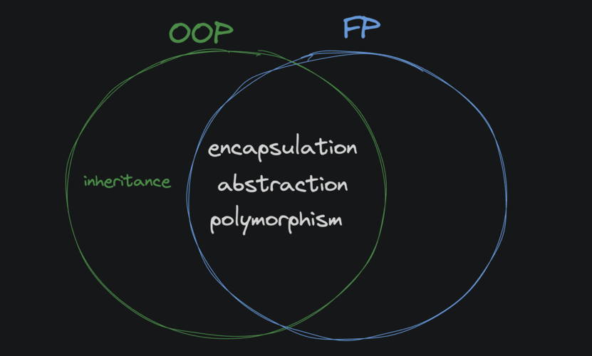

# <div align="center">What's Functional Programming</div>

### Work done by <span style="color:#ECAD35">Sara Eilenstine</span>, course and media are through <a href="https://www.boot.dev/">Boot.dev</a>!

<br>

# WHAT IS FUNCTIONAL PROGRAMMING?

Functional programming is a style (or "paradigm" if you're pretentious) of programming where we compose functions instead of mutating state (updating the value of variables).

- Functional programming is more about declaring what you want to happen, rather than how you want it to happen.
- Imperative (or procedural) programming declares both the what and the how.

### Example of imperative code:

```python
car = create_car()
car.add_gas(10)
car.clean_windows()
```

### Example of functional code:

```python
return clean_windows(add_gas(create_car()))
```

The important distinction is that in the functional example, we never change the value of the `car` variable, we just compose functions that return new values, with the outermost function, `clean_windows` in this case, returning the final result.

## DOC2DOC

In this course, we're working on "Doc2Doc", a command line tool for converting documents from one format to another. If you're familiar with Pandoc, the idea is similar.

# <span style="color:#0F77A5"><strong>Assignment</strong></span>

Complete the `stylize_title` function. It should take a single string as input, and return a single string as output. The returned string should have both the title centered and a border added.

- Use the provided functions `center_title` and `add_border`.
- Center the title before adding the border.
- Do not create any variables.
- Use only 1 line of code in the function body.

```python
def stylize_title(document):
    return add_border(center_title(document))


# Don't touch below this line
def center_title(document):
    width = 40
    title = document.split("\n")[0]
    centered_title = title.center(width)
    return document.replace(title, centered_title)


def add_border(document):
    title = document.split("\n")[0]
    border = "*" * len(title)
    return document.replace(title, title + "\n" + border)
```

# FUNCTIONAL VS OOP

Functional programming and object-oriented programming are styles for writing code. One isn't inherently superior to the other, but to be a well-rounded developer you should understand both well and use ideas from each when appropriate.

You'll encounter developers who love functional programming and others who love object-oriented programming. However, contrary to popular opinion, FP and OOP are _not_ always at odds with one another. They aren't opposites. Of the four pillars of OOP, <a href="https://en.wikipedia.org/wiki/Inheritance_(object-oriented_programming)">inheritance</a> is the only one that doesn't fit with functional programming.



Inheritance isn't seen in functional code due to the mutable classes that come along with it. Encapsulation, polymorphism and abstraction are still used all the time in functional programming.

When working in a language that supports ideas from both FP and OOP (like Python, JavaScript, or Go) the best developers are the ones who can use the best ideas from both paradigms effectively and appropriately.

# IMMUTABILITY

In FP, we strive to make data _**immutable**_. Once a value is created, it cannot be changed. _Mutable_ data, on the other hand, can be changed after it's created.

### _Why would I care?_

When a variable is immutable, you can be sure that it hasn't changed since it was created. It's a helluva lot easier to work with.

Generally speaking, immutability means fewer bugs and more maintainable code.

## TUPLES VS LISTS

Tuples and lists are both ordered collections of values, but tuples are immutable and lists are mutable.

You can append to a list, but you can not append to a tuple. You can create a new copy of a tuple using values from an existing tuple, but you can't change the existing tuple.

### LIST ARE MUTABLE

```python
ages = [16, 21, 30]
# 'ages' is being changed in place
ages.append(80)
# [16, 21, 30, 80]
```

### TUPLES ARE IMMUTABLE

```python
ages = (16, 21, 30)
more_ages = (80,) # note the comma! It's required for a single-element tuple
# 'all_ages' is a brand new tuple
all_ages = ages + more_ages
# (16, 21, 30, 80)
```

# <span style="color:#0F77A5"><strong>Assignment</strong></span>

The add_prefix function should do 2 things:

1. Add a prefix of `X.` to the beginning of each new document, where `X` is the index of the `document` in the batch. (The first document should be `0.` , next should be `1.` , etc.)
2. Return the documents tuple with the new document added to the end.

It accepts 2 arguments:

1. "document": a string
2. "documents": the current tuple of strings

### **Run the code to see the error.**

Whoever wrote this code assumed that `documents` is a list, but it's a tuple!

```python
def add_prefix(document, documents):
    prefix = f"{len(documents)}. "
    new_doc = prefix + document
    documents.append(new_doc)
    return documents
```

### Error:

```python
---------------------------------
Inputs:
 * document: ('hello there', 'sonny', 'how ya doing')
Expecting: ('0. hello there', '1. sonny', '2. how ya doing')
Actual: Error: 'tuple' object has no attribute 'append'
Fail
============= FAIL ==============
0 passed, 1 failed
```

**Fix the bug.** Instead of attempting to mutate the input tuple, create a brand new tuple with the new document added to the end and return that.

```python
def add_prefix(document, documents):
    # document - > strings and documents - > a tuple
    # I need to get the corrected string added into the already existing tuple.
    # While it may seem counterintuitive. If the tuple is immutable, how can you change it?
    # I think I have come to realize that you can add NEW data to the immutable object.
    # But once added, that data cannot be altered or changed. Only deleted or rewritten.

    # The prefix starts at zero as there is nothing in the tuple yet. Each addition, the prefix will be increased by 1.
    prefix = f"{len(documents)}. "
    # Add prefix to title of book.
    new_doc = prefix + document
    # Add that updated book to tuple variable.
    documents = documents + (new_doc,)
    return documents
```

# IT'S MATH

Functional programming tends to be popular amongst developers with a strong mathematical background. After all, a math equation isn't procedural: it's _declarative_. Take the following math equation:

```python
avg = Σx/N
```

To put this calculation in plain English:

- `Σ` is just the Greek letter Sigma, and it represents "the sum of a collection".
- `x` is the collection of numbers we're averaging.
- `N` is the number of elements in the collection.
- `avg` is equal to the sum of all the numbers in collection "x" divided by the number of elements in collection "x".

So, the equation really just says that avg is the average of all the numbers in collection "x". This math equation is a declarative way of writing "calculate the average of a list of numbers". Here's some imperative Python code that does the same thing:

```python
def get_average(nums):
    total = 0
    for num in nums:
        total += num
    return total / len(nums)
```

However, with functional programming, we would write code that's a bit more declarative:

```python
def get_average(nums):
    return sum(nums) / len(nums)
```

Here we're not keeping track of state (the `total` variable in the first example is <a href="https://en.wikipedia.org/wiki/State_(computer_science)#:~:text=In%20information%20technology%20and%20computer,known%20as%20its%20state%20space.">"stateful"</a>). We're simply composing functions together to get the result we want.

# <span style="color:#0F77A5"><strong>Assignment</strong></span>

Complete the `get_median_font_size` function. Given a list of numbers representing font sizes, return the median of the list. For example:

```python
[1, 2, 3] => 2
[10, 8, 7, 5] => 7
```

If there is an even amount of numbers, return the smaller of the two middle numbers (I know it's not a true median, but good for our purposes). If the list is empty, just return `None`.

Here are some helpful docs:

- `sorted`
- `len`
- `//` (floor division)

To be a good little functional programmer, your code should not:

- Use loops
- Mutate any variables (it's okay to create new ones)

```python
def get_median_font_size(font_sizes):
    # print(f"Sorted list: {sorted_fonts}")
    sorted_fonts = sorted(font_sizes)

    # Return None of the list is empty
    if len(font_sizes) == 0:
        return None

    # If list is even, Return smaller of the middle numbers.
    if len(font_sizes) % 2 == 0:

        # Finding index
        #   print( len(sorted_fonts) // 2 )
        #   print( (len(sorted_fonts) // 2) - 1 )

        # Indexing sorted list for Right and Left middle child
        #   print(f"The middle child: { sorted_fonts [ len ( sorted_fonts ) // 2 ] } " )
        #   print(f"The OTHER middle child: { sorted_fonts [(len(sorted_fonts) // 2) - 1 ] } " )
        return min ( sorted_fonts [ len(sorted_fonts) // 2 ] , sorted_fonts [ (len(sorted_fonts) // 2) - 1 ] )

    else:
        return sorted_fonts [ len(sorted_fonts) // 2 ]

# ALTERNATIVE SOLUTION
def get_median_font_size(font_sizes):

    if len(font_sizes) == 0:
        return None
    return sorted(font_sizes)[(len(font_sizes) - 1) // 2]
```

# DEBUGGING FP

It's nearly impossible, even for tenured senior developers, to write perfect code the first time. That's why debugging is such an important skill. The trouble is, sometimes you have these "elegant" (sarcasm intended) one-liners that are tricky to debug:

```python
def get_player_position(position, velocity, friction, gravity):
    return calc_gravity(calc_friction(calc_move(position, velocity), friction), gravity)
```

If the output of `get_player_position` is incorrect, it's hard to know what's going on inside that black box. Break it up! Then you can inspect the `moved`, `slowed`, and `final` variables more easily:

```python
def get_player_position(position, velocity, friction, gravity):
    moved = calc_move(position, velocity)
    slowed = calc_friction(moved, friction)
    final = calc_gravity(slowed, gravity)
    print("Given:")
    print(f"position: {position}, velocity: {velocity}, friction: {friction}, gravity: {gravity}")
    print("Results:")
    print(f"moved: {moved}, slowed: {slowed}, final: {final}")
    return final
```

Once everything is solved, I can remove the `print` statements.

# <span style="color:#0F77A5"><strong>Assignment</strong></span>

Fix the `format_line` function. It should apply the following transformations in order:

1. Strip whitespace from the beginning and end of the line.
2. Capitalize every character in the line.
3. Remove any periods from the line.
4. Suffix the line with an ellipsis: `words go here...`

_Run the code._ You should see that some subtle bugs are present. Break up the function to make it easier to debug. Use `print()` statements to see what's going on at each step.

### TIPS

// _Be careful about whitespace! It's easy to miss in console output. I sometimes add a character, like a | to the beginning and end of a string to make whitespace more obvious when print debugging._

- <a href="https://docs.python.org/3/library/stdtypes.html#str.replace">.replace(old, new)</a> can be used to replace all instances of a character in a string.
- <a href="https://docs.python.org/3/library/stdtypes.html#str.upper">.upper()</a> capitalizes an entire string, <a href="https://docs.python.org/3/library/stdtypes.html#str.capitalize">.capitalize()</a> capitalizes the first letter.
- <a href="https://docs.python.org/3/library/stdtypes.html#str.strip">.strip()</a> removes whitespace from the beginning and end of a string, <a href="https://docs.python.org/3/library/stdtypes.html#str.lstrip">.lstrip()</a> and <a href="https://docs.python.org/3/library/stdtypes.html#str.rstrip">.rstrip()</a> remove whitespace from the left and right respectively.

```python
def format_line(line):
    # What it was:
    print(f"Before: {line.rstrip().capitalize().replace(',', '')}....")

    # What it is:
    #   .strip() - remove all whitespace before and after string
    #   .upper() - capitalize all characters and not just first index
    #   .replace("," , "") -> .replace(".", "") - to remove all extra periods and not commas
    return f"{line.strip().upper().replace('.', '')}..."

```

---

### Work done by <span style="color:#ECAD35">Sara Eilenstine</span>, course and media are through <a href="https://www.boot.dev/">Boot.dev</a>!

<br>


