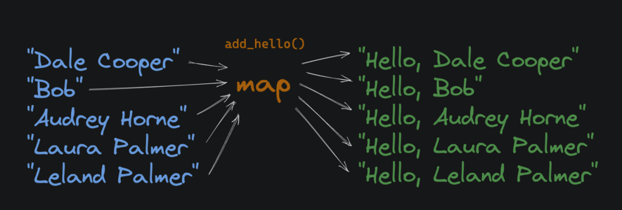

# <div align="center">First Class Function</div>

### Work done by <span style="color:#ECAD35">Sara Eilenstine</span>, course and media are through <a href="https://www.boot.dev/">Boot.dev</a>!

<br>

# FUNCTIONS AS VALUES

In Python, functions are just values, like strings, integers, or objects. For example, we can assign an existing function to a variable:

```python
def add(x, y):
    return x + y

# assign the function to a new variable
# called "addition". It behaves the same
# as the original "add" function
addition = add
print(addition(2, 5))
# 7
```

# <span style="color:#0F77A5"><strong>Assignment</strong></span>

With the popularity of generative AI (like ChatGPT), we need to be able to convert files into pure text to be injected into prompts.

**Complete the `file_to_prompt` function.** It should take a `file` dictionary and a `to_string` function as inputs and return a formatted string. The provided `to_string` function is responsible for converting the file dictionary into a string: you don't need to implement it, it's a value passed to your function.

However, your function should wrap the result of the `to_string` function in triple backticks (`````) to format it as a code block in Markdown. For example:

```python
an example string
```

should become:

```python
'''
an example string
'''
```

### TIPS

// _Note the two newlines! You don't need a trailing newline, but you do need the 2 newlines between the triple backticks. You can achieve this by using the newline `\n` escape character. Here's an example:_

```python
print("I wish the ring had never come to me.\nI wish none of this had happened.")
```

becomes:

```python
I wish the ring had never come to me.
I wish none of this had happened.
```

# <span style="color:#ECAD35">Solution</span>

````python
def file_to_prompt(file, to_string):
    return f"```\n{to_string(file)}\n```"
````

## OUTPUT

````python
---------------------------------
Inputs:
  filename: letter.txt
  content: But we think you're crazy to m...
  author_first_name: Brian
  author_last_name: Johnson

Expecting:
```
File: letter.txt
Author: Brian Johnson
Content: But we think you're crazy to make us write an essay telling you who we think we are.
```

Actual:
```
File: letter.txt
Author: Brian Johnson
Content: But we think you're crazy to make us write an essay telling you who we think we are.
```
Pass
============= PASS ==============
2 passed, 0 failed
````

# ANONYMOUS FUNCTIONS

Anonymous functions have _no name_, and in Python, they're called <a href="https://docs.python.org/3/reference/expressions.html#lambda">lambda functions</a> after <a href="https://en.wikipedia.org/wiki/Lambda_calculus">lambda calculus</a>. Here's a `lambda` function that takes a single argument `x` and returns the result of `x + 1`:

```python
lambda x: x + 1
```

Notice that the <a href="https://docs.python.org/3/reference/expressions.html#expressions">expression</a> `x + 1` is returned _automatically_, no need for a `return` statement. And because functions are just values, we can assign the function to a variable named `add_one`:

```python
add_one = lambda x: x + 1
print(add_one(2))
# 3
```

Lambda functions might look scary, but they're still just functions. Because they simply return the result of an expression, they're often used for small, simple evaluations. Here's an example that uses a lambda to get a value from a dictionary:

```python
get_age = lambda name: {
    'lane': 29,
    'hunter': 69,
    'allan': 17
}.get(name, 'not found')
print(get_age('lane'))
# 29
```

# <span style="color:#0F77A5"><strong>Assignment</strong></span>

Complete the `file_type_getter` function. This function accepts a list of tuples, where each tuple contains:

1. A "file type" (e.g. "code", "document", "image", etc)
2. A list of associated file extensions (e.g. `['.py', '.js']` or `['.docx', '.doc']`)

First, create a dictionary that maps each file extension to its corresponding file type, based on the input tuples. For example, the resulting dictionary might be:

```python
{
    '.doc': 'text',
    '.docx': 'document',
    '.py': 'code',
    '.jpg': 'image'
}
```

Next, return a `lambda` function that accepts a string (a file extension) and returns the corresponding file type. If the extension is not found in the dictionary, the lambda function should return `"Unknown"`. I used the <a href="https://docs.python.org/3/library/stdtypes.html#dict.get">.get</a> dictionary method to handle this.

# <span style="color:#ECAD35">Solution</span>

```python
def file_type_getter(file_extension_tuples):
    # Initialize new dictionary
    file_type_dictionary = {}

    # Get individual tuples from the list of tuples
    for file_tuple in file_extension_tuples:
        # Get the file types and their file names
        for file in file_tuple[1]:
            # And then add them to a dictionary
            file_type_dictionary[file] = file_tuple[0]

    #print(file_type_dictionary)

    return lambda ext: file_type_dictionary.get(ext, "Unknown")

    #### ALTERNATIVE SOLUTION ####
    # Initialize new dictionary
    file_type_dictionary = {}
    # Get individual file types and  list of extensions from the list of tuples
    for file_tuple, extensions in file_extension_tuples:
        # Get the individual extensions in the list of extensions
        for ext in extensions:
            # And then add them to a dictionary
            file_type_dictionary[ext] = file_tuple

    return lambda ext: file_type_dictionary.get(ext, "Unknown")
```

# MAP

"Map", "filter", and "reduce" are three commonly used higher-order functions in functional programming.

In Python, the built-in map function takes a function and an iterable (in this case a list) as inputs. It applies the function to each element in the iterable and returns a new iterable with all the results.



With map, we can operate on lists without using loops and nasty stateful variables. For example:

```python
def square(x):
    return x * x

nums = [1, 2, 3, 4, 5]
squared_nums = map(square, nums)
print(list(squared_nums))
# [1, 4, 9, 16, 25]
```

// _The <a href="https://docs.python.org/3/library/stdtypes.html#list">list type constructor</a>, `list()` converts the `map` object back into a standard list._

# <span style="color:#0F77A5"><strong>Assignment</strong></span>

Markdown supports two different styles of bullet points, `-` and `*`. We prefer `*`, so, we need a function to convert any `-` bullet points to `*` bullet points.

Complete the `change_bullet_style` function. It takes a document (a string) as input, and returns a single string as output. The returned string should have any lines that start with a `-` character replaced with a `*` character.

**This:**

```python
- This is a bullet
- This is a bullet
```

**Should become:**

```python
* This is a bullet
* This is a bullet
```

Use the built-in `map` function to apply the provided `convert_line` function to each line of the input string. Use `.split()` and `.join()` to split the document into a list of lines, and then join the lines back together. This should preserve the original line breaks.

Example of `split()` and `join()`

```python
# my_document is a string with newlines
lines_list = my_document.split("\n")

rejoined_doc = "\n".join(lines_list)
```

# <span style="color:#ECAD35">Solution</span>

```python
def change_bullet_style(document):
    # Split the document into a list, broken at the newline character, "\n"
    document = document.split("\n")
    # Use the function `map` to convert bulletin characters
    bullet_change = map(convert_line, document)
    # Rejoin the document lists at the newline characters, "\n"
    document = "\n".join(bullet_change)
    # Return said corrected document
    return document

    ### ALTERATIVE CODE ###
    # Do it in a single line >.>
     return "\n".join( map ( convert_line, document.split("\n") ) )

# Don't edit below this line

def convert_line(line):
    old_bullet = "-"
    new_bullet = "*"
    if len(line) > 0 and line[0] == old_bullet:
        return new_bullet + line[1:]
    return line
```

# FILTER

The built-in <a href="https://docs.python.org/3/library/functions.html#filter">`filter`</a> function takes a function and an iterable (in this case a list) and returns a _new_ iterable that only contains elements from the original iterable where the result of the function on that item returned `True`.


In Python:

```python
def is_even(x):
    return x % 2 == 0

numbers = [1, 2, 3, 4, 5, 6]
evens = list(filter(is_even, numbers))
print(evens)
# [2, 4, 6]
```

# <span style="color:#0F77A5"><strong>Assignment</strong></span>

Complete the `remove_invalid_lines` function.

- It accepts a document as input.
- It should use the built-in `filter` function and a lambda to return a copy of the input document.
- _Remove_ any lines that start with a `-` character.
- Preserve trailing newlines.

**This:**

```python
* Star Wars episode 1 is underrated
- Star Wars episode 9 is fine
* Star Wars episode 3 is the best
```

**Should become:**

```python
* Star Wars episode 1 is underrated
* Star Wars episode 3 is the best
```

# <span style="color:#ECAD35">Solution</span>

```python
def remove_invalid_lines(document):
    '''print(len(document))
    document = document.split("\n")
    print(len(document))
    document = "\n".join(document)
    print(len(document))'''

    return "\n".join(filter(lambda line: line.startswith("*"), document.split("\n"))) + "\n"
```

### TIPS

// _<a href="https://docs.python.org/3/library/stdtypes.html#str.join">.join</a>_

```python
"\n".join(["a", "b", "c"])
# a
# b
# c
```

// _<a href="https://docs.python.org/3/library/stdtypes.html#str.startswith">.startswith</a>_

```python
s = "hello"
s.startswith("h")
# True
s.startswith("o")
# False
```

// _<a href="https://docs.python.org/3/library/stdtypes.html#str.split">.split</a>_

```python
s = """hello
world"""
lines = s.split("\n")
# ['hello', 'world']
```

# REDUCE

The built-in <a href="https://docs.python.org/3/library/functools.html#functools.reduce">`functools.reduce()`</a> function takes a function and a list of values, and applies the function to each value in the list, accumulating a single result as it goes.


```python
# import functools from the standard library
import functools

def add(sum_so_far, x):
    print(f"sum_so_far: {sum_so_far}, x: {x}")
    return sum_so_far + x

numbers = [1, 2, 3, 4]
sum = functools.reduce(add, numbers)
# sum_so_far: 1, x: 2
# sum_so_far: 3, x: 3
# sum_so_far: 6, x: 4
# 10 doesn't print, it's just the final result
print(sum)
# 10
```

# <span style="color:#0F77A5"><strong>Assignment</strong></span>

# <span style="color:#ECAD35">Solution</span>

### Work done by <span style="color:#ECAD35">Sara Eilenstine</span>, course and media are through <a href="https://www.boot.dev/">Boot.dev</a>!

<br>


