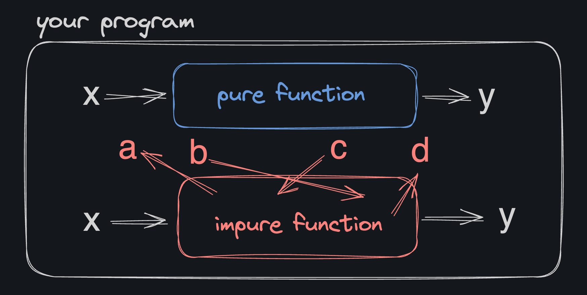
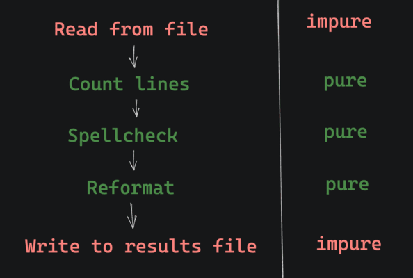

# <div align="center">Pure Functions</div>

### Work done by <span style="color:#ECAD35">Sara Eilenstine</span>, course and media are through <a href="https://www.boot.dev/">Boot.dev</a>!

<br>

# What's a Pure Function?

If you take nothing else away from this course, please take this: Pure functions are fantastic. They have two properties:

- They _always_ return the same value given the same arguments.
- Running them causes no side effects

**In short: pure functions don't do anything with anything that exists outside of their scope.**



## Example of a Pure Function:

```python
def findMax(nums):
    max_val = float('-inf')
    for num in nums:
        if max_val < num:
            max_val = num
    return max_val
```

## Example of an Impure Function:

```python
# instead of returning a value
# this function modifies a global variable
global_max = float('-inf')

def findMax(nums):
    global global_max
    for num in nums:
        if global_max < num:
            global_max = num
```

# <span style="color:#0F77A5"><strong>Assignment</strong></span>

There's a bug in the `convert_file_format` function! As it stands, it depends on some data that isn't scoped locally within the function. Those global values are mutated by external functions and are not guaranteed to be the same every time `convert_file_format` is called.

Fix the bug by making `convert_file_format` a pure function.

### Bugged Code

```python
valid_extensions = ["docx", "pdf", "txt", "pptx", "ppt", "md"]
valid_conversions = {
    "docx": ["pdf", "txt", "md"],
    "pdf": ["docx", "txt", "md"],
    "txt": ["docx", "pdf", "md"],
    "pptx": ["ppt", "pdf"],
    "ppt": ["pptx", "pdf"],
    "md": ["docx", "pdf", "txt"],
}

def convert_file_format(filename, target_format):

    current_format = filename.split(".")[-1]
    if (
        current_format in valid_extensions
        and target_format in valid_conversions[current_format]
    ):
        return filename.replace(current_format, target_format)
    return None
```

# <span style="color:#ECAD35">Solution</span>

```python
# Just bring everything inside of the function.

def convert_file_format(filename, target_format):
    valid_extensions = ["docx", "pdf", "txt", "pptx", "ppt", "md"]
    valid_conversions = {
    "docx": ["pdf", "txt", "md"],
    "pdf": ["docx", "txt", "md"],
    "txt": ["docx", "pdf", "md"],
    "pptx": ["ppt", "pdf"],
    "ppt": ["pptx", "pdf"],
    "md": ["docx", "pdf", "txt"],
    }
    current_format = filename.split(".")[-1]
    if (
        current_format in valid_extensions
        and target_format in valid_conversions[current_format]
    ):
        return filename.replace(current_format, target_format)
    return None
```

# PURE FUNCTION REVIEW

Pure functions have _a lot_ of benefits. Whenever possible, good developers try to use pure functions instead of impure functions. Remember, pure functions:

- Return the same result if given the same arguments. They are <a herf="https://en.wikipedia.org/wiki/Deterministic_system">deterministic</a>.
- Do not change the external state of the program. For example, they do not change any variables outside of their scope.
- Do not perform any <a href="https://en.wikipedia.org/wiki/Input/output">I/O operations</a> (like reading from disk, accessing the internet, or writing from the console).

These properties result in pure functions being easier to test, debug, and think about.

Refer to the following examples and answer the questions.

## Example 1:

```python
# Pure
def multiply_by2(nums):
    products = []
    for num in nums:
        products.append(num*2)
    return products
```

## Example 2:

```python
# Impure: calls upon variables that is outside of their scope
balance = 1000
cars = []

def buy_car(new_car):
    cars.append(new_car)
    balance -= 69
```

## Example 3:

```python
# Impure: Is not deterministic
import random

def roll_die(num_sides):
    return random.randint(1, num_sides)
```

# REFERENCE VS VALUE

When you pass a value into a function as an argument, one of two things can happen:

It's passed by reference: The function has access to the original value and can change it
It's passed by value: The function only has access to a copy. Changes to the copy within the function don't affect the original
There is a bit more nuance, but this explanation mostly works.

### These types are passed by reference:

- Lists
- Dictionaries
- Sets

### These types are passed by value:

- Integers
- Floats
- Strings
- Booleans
- Tuples

Most collection types are passed by reference (except for tuples) and most primitive types are passed by value.

## EXAMPLE OF PASS BY REFERENCE (MUTABLE)

```python
def modify_list(inner_lst):
    inner_lst.append(4)
    # the original "outer_lst" is updated
    # because inner_lst is a reference to the original

outer_lst = [1, 2, 3]
modify_list(outer_lst)
# outer_lst = [1, 2, 3, 4]
```

## EXAMPLE OF PASS BY VALUE (IMMUTABLE)

```python
def attempt_to_modify(inner_num):
    inner_num += 1
    # the original "outer_num" is not updated
    # because inner_num is a copy of the original

outer_num = 1
attempt_to_modify(outer_num)
# outer_num = 1
```

# <span style="color:#0F77A5"><strong>Assignment</strong></span>

We have a way for Doc2Doc users to set their supported formats in their settings. In memory, we store those settings as a simple dictionary:

```python
settings = {
    "docx": True,
    "pdf": True,
    "txt": False
}
```

Unfortunately, there is a bug in our code! When a new format is added or removed, it not only updates the new dictionary, but it changes the defaults themselves! That's not good. We want to create a new dictionary with the updates, not change the original.

Fix the bug by making `add_format` and `remove_format` pure functions that don't mutate their inputs.

# <span style="color:#ECAD35">Solution</span>

```python
def add_format(default_formats, new_format):
    copy_default_formats = default_formats.copy()
    copy_default_formats[new_format] = True
    return copy_default_formats


def remove_format(default_formats, old_format):
    copy_default_formats = default_formats.copy()
    copy_default_formats[old_format] = False
    return copy_default_formats
```

### TIP

// _The <a href="https://docs.python.org/3/library/copy.html">`.copy()`</a> method can be used to creaTe a new copy of a dictionary_

# PASS BY REFERENCE IMPURITY

Because certain types in Python are passed by reference, we can mutate values that we didn't intend to. This is a form of function impurity.

Remember, a pure function should have no side effects. It shouldn't modify anything outside of its scope, including its inputs. It should return new copies of inputs instead of changing them.

## PURE FUNCTION

```python
def remove_format(default_formats, old_format):
    new_formats = default_formats.copy()
    new_formats[old_format] = False
    return new_formats
```

## IMPURE FUNCTION

```python
def remove_format(default_formats, old_format):
    default_formats[old_format] = False
    return default_formats
```

## WHY DO WE CARE?

One of the biggest differences between good and great developers is how often they incorporate pure functions into their code. Pure functions are easier to read, easier to reason about, easier to test, and easier to combine. Even if you're working in an imperative language like Python, you can (and should) write pure functions whenever reasonable.

There's nothing worse than trying to debug a program where the order functions are called needs to be juuuuust right because they all read and modify the same global variable.

# INPUT AND OUTPUT ( I/O )

The term "i/o" stands for input/output. In the context of writing programs, i/o refers to anything in our code that interacts with the "outside world". "Outside world" just means anything that's not stored in our application's memory (like variables).

## EXAMPLES OF I/O

- Reading from or writing to a file on the hard drive
- Accessing the internet
- Reading from or writing to a database
- Even simply printing to the console is considered i/o!

_All i/o is a form of "side effect"._

# <span style="color:#0F77A5"><strong>Assignment</strong></span>

In Doc2Doc we frequently need to change the casing of some text. For example:

### TITLECASE

```python
Every Day Once A Day Give Yourself A Present
```

### LOWERCASE

```python
every day once a day give yourself a present
```

### UPPERCASE

```python
EVERY DAY ONCE A DAY GIVE YOURSELF A PRESENT
```

There is an issue in the `convert_case` function, our test suite can't test its behavior because it's printing to the console (eww... a side-effect) instead of returning a value.

Fix the function so that it returns the correct value instead of printing it.

### Bugged Code

```python
def convert_case(text, target_format):
    if not text or not target_format:
        raise ValueError(f"No text or target format provided")

    if target_format == "uppercase":
        print(text.upper())
        return
    if target_format == "lowercase":
        print(text.lower())
        return
    if target_format == "titlecase":
        print(text.title())
        return
    raise ValueError(f"Unsupported format: {target_format}")
```

# <span style="color:#ECAD35">Solution</span>

```python
def convert_case(text, target_format):

    if not text or not target_format:
        raise ValueError(f"No text or target format provided")

    if target_format == "uppercase":
        return text.upper()
    if target_format == "lowercase":
        return text.lower()
    if target_format == "titlecase":
        return text.title()

    raise ValueError(f"Unsupported format: {target_format}")
```

# SHOULD I I/O?

A program that doesn't do _any_ i/o is pretty useless. What's the point of computing something if you can't see the results?

In functional programming, i/o is viewed as _dirty but necessary_. We know we can't eliminate i/o from our code, so we just _contain_ it as much as possible. There should be a clear place in your project that does nasty i/o stuff, and the rest of your code can be pure.

For example, a Python program might:

1. Read a file from the hard drive as the program starts
2. Run a bunch of pure functions to analyze the data
3. Write the results of the analysis to a file on the hard drive at the end



# NO-OP

A <A href="https://en.wikipedia.org/wiki/NOP_(code)">no-op</a> is an operation that does... nothing. If a function doesn't return anything, it's probably impure. If it doesn't return anything, the only reason for it to exist is to perform a side effect.

## EXAMPLE OF NO-OP

This function performs a useless computation because it doesn't return anything or perform a side-effect. It's a no-op.

```python
def square(x):
    x * x
```

## EXAMPLE SIDE-EFFECT

This function performs a side effect. It changes the value of the `y` variable that is outside of its scope. It's impure.

```python
y = 5
def add_to_y(x):
    global y
    y += x

add_to_y(3)
# y = 8
```

_The <a href="https://docs.python.org/3/reference/simple_stmts.html#global">`global`</a> keyword just tells Python to allow access to the outer-scoped `y` variable._

## PRINT()

Even the `print()` function (technically) has an impure side effect! It doesn't return anything, but it does print text to the console, which is a form of i/o.

# <span style="color:#0F77A5"><strong>Assignment</strong></span>

Complete the `remove_emphasis`, `remove_emphasis_from_line`, and `remove_emphasis_from_word` functions. They are currently no-ops.

`remove_emphasis` is the parent function. It takes a full document removes any _single or double_ `*` characters that are at the start or end of a word. (<a href="https://www.markdownguide.org/basic-syntax/#emphasis">Emphasis</a> in markdown)

**For example, this:**

```markdown
I _love_ markdown.
I **really love** markdown.
```

**Should become:**

```markdown
I love markdown.
I really love markdown.
```

Write the helper functions, they will make the remove_emphasis function much easier to write:

- The `remove_emphasis_from_line` function should remove emphasis from a single line of text.
- The `remove_emphasis_from_word` function should remove emphasis from a single word.

# <span style="color:#ECAD35">Solution</span>

```python
def remove_emphasis_from_word(word):
    new_word = ""
    for letter in word:
        if letter != "*":
            new_word += letter
    return new_word


def remove_emphasis_from_line(line):
    new_line = line.strip().split()
    # Used list comprehension over map() function as it is just more readable.
    corrected_line = ' '.join([remove_emphasis_from_word(word) for word in new_line])

    # Removed bug. This was causing extra newline in remove_emphasis() function
    '''corrected_line += "\n" '''
    return corrected_line


def remove_emphasis(doc_content):
    new_doc_content = []
    new_doc = doc_content.split("\n")
    #print(new_doc)
    #print(remove_emphasis_from_line(new_doc[0]))
    #print(len(new_doc))
    for line in new_doc:
        new_doc_content.append(remove_emphasis_from_line(line))

    #print(new_doc_content)
    return "\n".join(new_doc_content)

    '''
    new_doc_content = ""
    new_doc = doc_content.split("\n")
    for line in new_doc:
        new_doc_content += remove_emphasis_from_line(line)
    #return new_doc_content
    '''

##### TESTING #####
#remove_emphasis_from_word("*love*")
#remove_emphasis_from_word("**love**")
#remove_emphasis_from_line("The **answer to the ultimate question** of life, the universe and everything is *42*\n")
#remove_emphasis()

```

### TIPS

// _For the sake of practice, try it without the `.replace()` string method. I used some of these built-ins:_

- <a href="https://docs.python.org/3/library/stdtypes.html#str.split">`str.split`</a>
- <a href="https://docs.python.org/3/library/stdtypes.html#str.strip">`str.split`</a>
- <a href="https://docs.python.org/3/library/functions.html#map">`map`</a>
- <a href="https://docs.python.org/3/library/stdtypes.html#str.join">`join`</a>

# MEMOIZATION

At its core, <a href="https://en.wikipedia.org/wiki/Memoization">memoization</a> is just <a href="https://en.wikipedia.org/wiki/Cache_(computing)">caching</a> (storing a copy of) the result of a computation so that we don't have to compute it again in the future.

For example, take this simple function:

```python
def add(x, y):
    return x + y
```

A call to `add(5, 7)` will _always_ evaluate to `12`. So, if you think about it, once we know that `add(5, 7)` can be replaced with `12`, we can just store the value 12 somewhere in memory so that we don't have to do the addition operation again in the future. Then, if we need to `add(5, 7)` again, we can just look up the value `12` instead of doing a (potentially expensive) CPU operation.

The slower and more complex the function, the more memoization can help speed things up.

_Note: It's pronounced "memOization", not "memORization". This confused me for quite a while in college, I thought my professor just didn't speak goodly..._

# <span style="color:#0F77A5"><strong>Assignment</strong></span>

Counting the words in a document can be slow, so we want to _memoize_ it. Complete the `word_count_memo` function.

**It takes two inputs:**

1. A document string.
2. A memos dictionary. The keys are full document strings, and the values are the word count of the document.

**It should return two values:**

1. The word count of the given document
2. An updated memos dictionary.

Here are the steps to follow:

1. Create a `.copy()` of the `memos` dictionary.
2. If the document is `in` the memos dictionary, just `return` the associated word count and the `memos` copy. No need to recompute the word count.
3. Otherwise, use the provided `word_count` function to count the words in the given `document`.
4. Store the word count in the `memos` copy.
5. `return` the word count and the updated `memos` copy.

# <span style="color:#ECAD35">Solution</span>

```python
def word_count_memo(document, memos):
    # Create a .copy() of the memos dictionary.
    memos_copy = memos.copy()

    # If document is in memos_copy, just return its value and memos copy
    if document in memos_copy:
        return memos_copy[document], memos_copy

    # Otherwise, add the document and word count to memos copy
    memos_copy[document] = word_count(document)

    # Then return word count and the memos copy
    return word_count(document), memos_copy

# Don't edit below this line


def word_count(document):
    count = len(document.split())
    return count
```

# REFERENTIAL TRANSPARENCY

Pure functions are always <a href="https://www.baeldung.com/cs/referential-transparency#referential-transparency">referentially transparent</a>.

"Referential transparency" is a fancy way of saying that a function call can be replaced by its would-be return value because it's the same every time. **Referentially transparent functions can be safely memoized.** For example `add(2, 3)` can be smartly replaced by the value `5`.

The great thing about pure functions is that they can always be safely memoized. Impure functions can't be because they might do something in addition to returning a static value, or they might return different values given the same arguments.

# SHOULD I ALWAYS MEMOIZE?

No! Memoization is a _tradeoff_ between memory and speed. If your function is fast to execute, it's probably not worth memoizing, because the amount of RAM (memory) your program will need to store the results will go way up.

It's also a bunch of extra code to write, so you should only do it if you have a good reason to.

---

### Work done by <span style="color:#ECAD35">Sara Eilenstine</span>, course and media are through <a href="https://www.boot.dev/">Boot.dev</a>!

<br>


