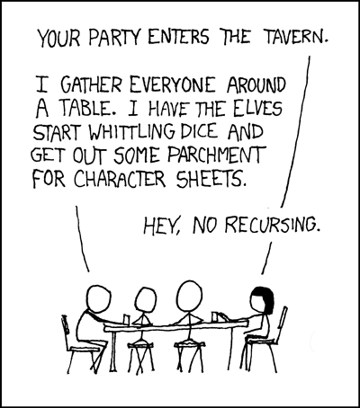

# <div align="center">Recursion</div>

### Work done by <span style="color:#ECAD35">Sara Eilenstine</span>, course and media are through <a href="https://www.boot.dev/">Boot.dev</a>!

<br>

# WHAT'S RECURSION?

<a href="https://en.wikipedia.org/wiki/Recursion_(computer_science)">Recursion</a> is a famously tricky concept to grasp, but it's honestly quite simple - don't let it intimidate you! A recursive function is just a function that calls itself!

```
Recursion is the process of defining something in terms of itself.
```

## EXAMPLE OF RECURSION

If you thought loops were the only way to iterate over a list, you were wrong! Recursion is fundamental to functional programming because it's how we iterate over lists while avoiding stateful loops. Take a look at this function that sums the numbers in a list:

```python
def sum(nums):
    if len(nums) == 0:
        return 0
    return nums[0] + sum(nums[1:])

print(sum([1, 2, 3, 4, 5]))
# 15
```

Don't break your brain on the example above! Let's break it down step by step:

### 1. SOLVE A SMALL PROBLEM

Our goal is to sum all the numbers in a list, but we're not allowed to loop. So, we start by solving the smallest possible problem: summing the first number in the list with the rest of the list:

```python
return nums[0] + sum(nums[1:])
```

### 2. RECURSE

So, what actually happens when we call `sum(nums[1:])`? Well, we're just calling `sum` with a smaller list! In the first call, the `nums` input was `[1, 2, 3, 4, 5]`, but in the next call it's just `[2, 3, 4, 5]`. We just keep calling `sum` with smaller and smaller lists.

### 3. THE BASE CASE

So what happens when we get to the "end"? `sum(nums[1:])` is called, but `nums[1:]` is an empty list because we ran out of numbers. We need to write a base case to stop the madness.

```python
if len(nums) == 0:
    return 0
```

The "base case" of a recursive function is the part of the function that **_does not_** call itself.

# <span style="color:#0F77A5"><strong>Assignment</strong></span>

Doc2Doc can automatically generate various layouts for a page. There are a lot of possible layouts, so we need a factorial function to calculate the total number of possible layouts.

A factorial is the product of all positive integers less than or equal to a number. For example, `5!` (read: "five factorial") is `5 * 4 * 3 * 2 * 1`, which is `120`.

Complete `factorial_r` function. It should recursively calculate the factorial of a number.

# <span style="color:#ECAD35">Solution</span>

```python
def factorial_r(x):
    if x == 0:
        return 1
    return x * factorial_r(x - 1)
```

### TIPS

1. _What's a small problem you can solve first?_
2. _How can you go from the "first" value of `x` to the "next" value of `x`, all the way down to the "last" value of `x`?_
3. _What's the base case that should stop the recursion?_
4. _Since `0!` is an <a href="https://en.wikipedia.org/wiki/Empty_product">empty product</a>, what should an input of `0` return?_

# RECURSION REVIEW



The joke is that the characters within the Dungeons and Dragons game are also playing their own Dungeons and Dragons game. Maybe their character's game of DnD also has characters playing DnD, and so on, recursively forever.

## ANOTHER EXAMPLE

```python
def print_chars(word, i):
    if i == len(word):
        return
    print(word[i])
    print_chars(word, i + 1)

print_chars("Hello", 0)
# H
# e
# l
# l
# o

print_chars('elephant', 3)
# p
# h
# a
# n
# t
```

# ZIPMAP

This is another simple recursive function.

# <span style="color:#0F77A5"><strong>Assignment</strong></span>

Within Doc2Doc we need to map certain properties from one document to properties of another document. Complete the recursive `zipmap` function.

It takes two lists as input and returns a dictionary where the first list provides the _keys_ and the second list provides the _values_.

Example usage:

```python
zipped = zipmap(
    ["Avatar: The Last Airbender", "Avatar (in Papyrus font)", "The Last Airbender (Live Action)"],
    [9.9, 6.1, 2.1]
)

print(zipped)
# {
#   'Avatar: The Last Airbender': 9.9,
#   'Avatar (in Papyrus font)': 6.1,
#   'The Last Airbender (Live Action)': 2.1,
# }
```

### Here's the pseudocode:

1. If either the `keys` or `values` list is empty, return an empty dictionary (base case).
2. Recursively call `zipmap` on all but the first element from `keys` and `values`
3. Add the first element of `keys` to the resulting dictionary, and set its value to the first element in `values`
4. Return the updated dictionary

# <span style="color:#ECAD35">Solution</span>

```python

```

### Work done by <span style="color:#ECAD35">Sara Eilenstine</span>, course and media are through <a href="https://www.boot.dev/">Boot.dev</a>!

<br>


