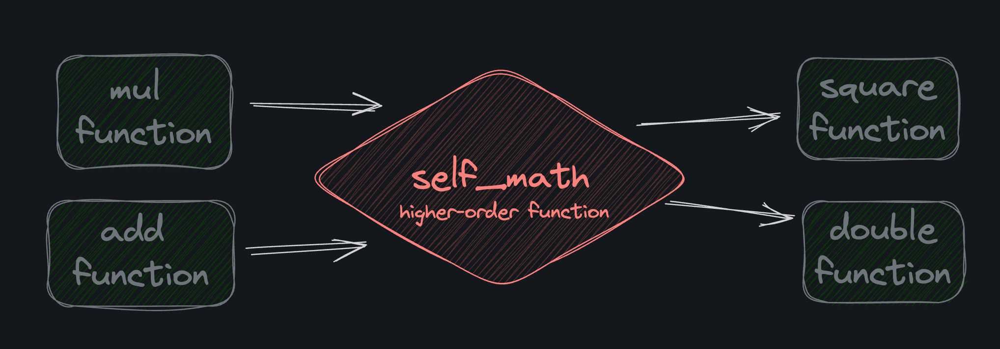

# <div align="center">Function Transformations</div>

### Work done by <span style="color:#ECAD35">Sara Eilenstine</span>, course and media are through <a href="https://www.boot.dev/">Boot.dev</a>!

<br>

# WHAT'S FUNCTION TRANSFORMATION?

"Function transformation" is just a more concise way to describe a specific type of <a href="https://en.wikipedia.org/wiki/Higher-order_function">higher order function</a>. It's when a function takes a function (or functions) as input and returns a new function. Let's look at an example:



```python
def multiply(x, y):
    return x * y

def add(x, y):
    return x + y

# self_math is a higher order function
# input: a function that takes two arguments and returns a value
# output: a new function that takes one argument and returns a value
def self_math(math_func):
    def inner_func(x):
        return math_func(x, x)
    return inner_func

square_func = self_math(multiply)
double_func = self_math(add)

print(square_func(5))
# prints 25

print(double_func(5))
# prints 10
```

The `self_math` function takes a function that operates on two different parameters (e.g. multiply or add) and returns a new function that operates on one parameter twice (e.g. square or double).

# <span style="color:#0F77A5"><strong>Assignment</strong></span>

Doc2Doc needs a good logging system so that users and developers alike can see what's going on under the hood. Complete the `get_logger` function.

It takes a `formatter` function as a parameter and returns a new function. Steps:

1. Define a new function inside `get_logger` (see `self_math` above as an example). It accepts two strings. You can just name them `first` and `second` if you like.
2. The `logger` function should _not return anything_. It should simply `print` the result of calling the given `formatter` function with the `first` and `second` strings as arguments.
3. Return the new `logger` function for the test suite to use.

### TIP

// _The `colon_delimit` and `dash_delimit` functions are "formatters" that will be passed into our get_logger function by the tests. You don't need to touch them, but it's important to understand that when you `call formatter()` in the `get_logger` function, you're calling one of these functions._

# <span style="color:#ECAD35">Solution</span>

```python
def get_logger(formatter):
    # ?
    def log_format(first, second):
        print(formatter(first, second))

    return log_format


# Don't edit below this line

def test(first, errors, formatter):
    print("Logs:")
    logger = get_logger(formatter)
    for err in errors:
        logger(first, err)
    print("====================================")


def colon_delimit(first, second):
    return f"{first}: {second}"


def dash_delimit(first, second):
    return f"{first} - {second}"


def main():
    db_errors = [
        "out of memory",
        "cpu is pegged",
        "networking issue",
        "invalid syntax",
    ]
    test("Doc2Doc FATAL", db_errors, colon_delimit)

    mail_errors = [
        "email too large",
        "non alphanumeric symbols found",
    ]
    test("Doc2Doc WARNING", mail_errors, dash_delimit)


main()

'''
Output:
Logs:
Doc2Doc FATAL: out of memory
Doc2Doc FATAL: cpu is pegged
Doc2Doc FATAL: networking issue
Doc2Doc FATAL: invalid syntax
====================================
Logs:
Doc2Doc WARNING - email too large
Doc2Doc WARNING - non alphanumeric symbols found
====================================
'''
```

# TRANSFORMATIONS REVIEW

**Example of a function transformation:**

```python
def multiply(x, y):
    return x * y

def add(x, y):
    return x + y

def self_math(math_func):
    # inner_func is defined inside self_math.
    # It can only be referenced directly
    # inside self_math's scope. However, it is then
    # returned and can be captured into a new variable
    # like square_func or double_func, and called that way
    def inner_func(x):
        return math_func(x, x)
    return inner_func

square_func = self_math(multiply)
double_func = self_math(add)

print(square_func(5))
# 25

print(double_func(5))
# 10
```

### Answer these questions:

```python
# What does the expression 'self_math(add)' return?
A function '''return inner_func'''

# Where can 'inner_func' be referenced directly?
Only within self_math()
```

# MORE TRANSFORMATIONS

Here's some example code for you to reference as you work through the assignment:

```python
def multiply(x, y):
    return x * y

def add(x, y):
    return x + y

def self_math(math_func):
    def inner_func(x):
        return math_func(x, x)
    return inner_func

square_func = self_math(multiply)
double_func = self_math(add)

print(square_func(5))
# prints 25

print(double_func(5))
# prints 10
```

# <span style="color:#0F77A5"><strong>Assignment</strong></span>

Complete the `doc_format_checker_and_converter` function.

It takes a `conversion_function` and a list of `valid_formats` as parameters. It should return a _new function_ that takes two parameters of its own:

- `filename`: The name of the file to be converted
- `content`: The content (body text) of the file to be converted

If the file extension of the `filename` is in the `valid_formats` list, then it should return the result of calling the `conversion_function` on the `content`. Otherwise, it should <a href="https://docs.python.org/3/tutorial/errors.html#raising-exceptions">raise</a> a <a href="https://docs.python.org/3/library/exceptions.html#ValueError">ValueError</a> with the message `"Invalid file format"`.

# <span style="color:#ECAD35">Solution</span>

```python
def doc_format_checker_and_converter(conversion_function, valid_formats):

    def doc_checker(filename, content):
        check_filename = filename.split(".")
        if check_filename[1] in valid_formats:
            return conversion_function(content)
        else:
            raise ValueError("Invalid file format")

    return doc_checker


# Don't edit below this line

def capitalize_content(content):
    return content.upper()


def reverse_content(content):
    return content[::-1]

# OUTPUT
'''
---------------------------------
Inputs:
 * conversion_func: capitalize_content
 * filename: sample.txt
 * doc_content: I really don't feel like screaming today.
 * valid_formats: ['txt', 'md', 'doc']
Expecting: I REALLY DON'T FEEL LIKE SCREAMING TODAY.
Actual: I REALLY DON'T FEEL LIKE SCREAMING TODAY.
Pass
---------------------------------
Inputs:
 * conversion_func: reverse_content
 * filename: testing.doc
 * doc_content: This is probably how they write in the red room in Twin Peaks...
 * valid_formats: ['txt', 'md', 'doc']
Expecting: ...skaeP niwT ni moor der eht ni etirw yeht woh ylbaborp si sihT
Actual: ...skaeP niwT ni moor der eht ni etirw yeht woh ylbaborp si sihT
Pass
============= PASS ==============
2 passed, 0 failed
'''
```

### TIP

// _I used the `.split()` method on the `filename` to get the file extension. You can use the `in` keyword to check if a value is in a list._

// _The `capitalize_content` and `reverse_content` are "conversion functions" that will be passed into our `doc_format_checker_and_converter` function by the tests._

# WHY TRANSFORM?

You might be wondering:

- "When would I use function transformations in the real world?"
- "Isn't it simpler to just define functions at the top level of the code, and call them as needed?"

Good questions. To be clear, we don't just transform functions at <a href="https://en.wikipedia.org/wiki/Execution_(computing)#Runtime">runtime</a> for the fun of it! We only use advanced techniques like function transformations when they make our code _simpler than it would otherwise be_.

## CODE REUSABILITY

Creating variations of the same function dynamically can make it a lot easier to share common functionality. Take a look at this `formatter` function. It accepts a "pattern" and returns a new function that formats text according to that pattern:

```python
def formatter(pattern):
    def inner_func(text):
        result = ""
        i = 0
        while i < len(pattern):
            if pattern[i:i+2] == '{}':
                result += text
                i += 2
            else:
                result += pattern[i]
                i += 1
        return result
    return inner_func
```

Now we can create new formatters easily:

```python
bold_formatter = formatter("**{}**")
italic_formatter = formatter("*{}*")
bullet_point_formatter = formatter("* {}")
```

And use them like this:

```python
print(bold_formatter("Hello"))
# **Hello**
print(italic_formatter("Hello"))
# *Hello*
print(bullet_point_formatter("Hello"))
# * Hello
```

## CLOSURES

90% of the time, when I use function transformations, it's because I want to create a closure. We'll talk about closures in the next chapter!

## Answer these questions:

```python
# We should use function transformations ____
When it results in more understandable and extendable code

# Couldn't we just explicitly define bold_formatter, italic_formatter, and bullet_point_formatter as normal functions?
Yes, but it would probably require more code
```

# <span style="color:#0F77A5"><strong>Assignment: FILTER COMMAND</strong></span>

In Doc2Doc, users are asking for a filtering feature. They want a command that has dynamic options so they can work as quickly as possible.

Complete the `get_filter_cmd function`. It takes two functions as input, `filter_one` and `filter_two`, and returns a function, `filter_cmd`.

`filter_cmd` should take as input a string `content` to be filtered, and a string `option` with a default value of `--one`. The `filter_cmd` should filter and return the content according to the input `option`. Do not use the builtin `filter` function.

1. If `--one`, use `filter_one`
2. If `--two`, use `filter_two`
3. If `--three`, use `filter_one` first, then use `filter_two`
4. If another option is passed, raise an exception, `"invalid option"`

# <span style="color:#ECAD35">Solution</span>

```python
def get_filter_cmd(filter_one, filter_two):

    def filter_cmd(content, option="--one"):
        if option == "--one":
            return filter_one(content)
        elif option == "--two":
            return filter_two(content)
        elif option == "--three":
            content = filter_one(content)
            return filter_two(content)
        else:
            raise Exception("invalid option")

    return filter_cmd


# don't touch below this line

def replace_bad(text):
    return text.replace("bad", "good")


def replace_ellipsis(text):
    return text.replace("..", "...")


def fix_ellipsis(text):
    return text.replace("....", "...")
```

# <span style="color:#0F77A5"><strong>Assignment: UPGRADE FILTER COMMAND</strong></span>

Complete the `get_filter_cmd` function. It should take a dictionary as input, `filters`, and return a function, `filter_cmd`. `filters` contains option string and filter function key/value pairs. `filter_cmd` should take as input a string content to be filtered, a list of strings `options`, and a list of tuples `word_pairs`.

- The `filter_cmd` should filter and return the `content`, filtered according to the input `options`.
- If there are no options in the `options` list, raise an exception `"missing options"`.
- For each option, if its option string is in the `filters` dictionary, then filter the `content` by passing the `content` and `word_pairs` to the option's filter.
- If an option is not in the `filters` dictionary, raise an exception `"invalid option"`.

# <span style="color:#ECAD35">Solution</span>

```python
def get_filter_cmd(filters):
    # IN dict OUT function

    def filter_cmd(content, options, word_pairs):
        # IN a string (content), list of strings (options), list of tuples (word_pairs)
        # OUT filtered and return string (content)
        if options == []:
            raise Exception("missing options")

        for filter_opts in options:
            if filter_opts in filters:
                content = filters[filter_opts](content, word_pairs)
            else:
                raise Exception("invalid option")

        return content


    return filter_cmd


# don't touch below this line


def replace_words(content, word_pairs):
    for pair in word_pairs:
        content = content.replace(pair[0], pair[1])
    return content


def remove_words(content, word_pairs):
    for pair in word_pairs:
        content = content.replace(pair[0], "")
    return content


def capitalize_sentences(content, word_pairs):
    return ". ".join(map(str.capitalize, content.split(". ")))


def uppercase_words(content, word_pairs):
    for pair in word_pairs:
        content = content.replace(pair[0], pair[0].upper())
    return content


filters = {
    "--replace": replace_words,
    "--remove": remove_words,
    "--capitalize": capitalize_sentences,
    "--uppercase": uppercase_words,
}

# OUTPUT

'''
Filters:
* (--replace, replace_words)
* (--remove, remove_words)
* (--capitalize, capitalize_sentences)
* (--uppercase, uppercase_words)
---------------------------------
Content: hello world. this is a test.
Options:
--replace
--capitalize
Word Pairs:
('hello', 'hi')
('world', 'earth')
('test', 'test case')
Expecting: Hi earth. This is a test case.
   Actual: Hi earth. This is a test case.
Pass
---------------------------------
Content: hello world. this is a test.
Options:
--capitalize
--uppercase
Word Pairs:
('world', 'earth')
('test', 'test case')
Expecting: Hello WORLD. This is a TEST.
   Actual: Hello WORLD. This is a TEST.
Pass
---------------------------------
Content: the quick brown fox jumps over the lazy dog.
Options:
Word Pairs:
Expecting: missing options
   Actual: missing options
Pass
============= PASS ==============
3 passed, 0 failed
'''
```

# <span style="color:#0F77A5"><strong>Assignment: PAGINATION</strong></span>

Users should be able to paginate lengthy documents to make them managable. Pagination is simply dividing a document into pages. This idea can also be applied to other data besides raw text, such as a list of search results or api responses.

1. Complete the `paginator` function. It takes as input a number `page_length` and returns a function, `paginate`.
2. `paginate` should take as input a `document` string input and return a list of substring pages.
3. Complete the `add_word_to_page` function. It takes as input a list of strings, `pages`, and string, `word`, and returns `pages` with the word added.
   - If `pages` is empty, return the `word` in a list
   - Every page will have at least one word, even if that word is longer than the `page_length`
4. Use the `reduce` function from the `functools` module to convert the `document` into a list of pages using the `add_word_to_page` function

```python
paginate = paginator(11)
pages = paginate("Boots loves salmon because he is a bear.")
# pages: ["Boots loves", "salmon", "because he", "is a bear."]
```

# <span style="color:#ECAD35">Solution</span>

```python
from functools import reduce


def paginator(page_length):
    def paginate(document):
        words = document.split()

        def add_word_to_pages(pages, word):
            if len(pages) == 0:
                return [word]
            pages_copy = pages.copy()
            current_page = pages_copy[-1]
            if len(current_page) + len(word) + 1 > page_length:
                pages_copy.append(word)
            else:
                pages_copy[-1] = current_page + " " + word
            return pages_copy

        return reduce(add_word_to_pages, words, [])

    return paginate

```

### Work done by <span style="color:#ECAD35">Sara Eilenstine</span>, course and media are through <a href="https://www.boot.dev/">Boot.dev</a>!

<br>


