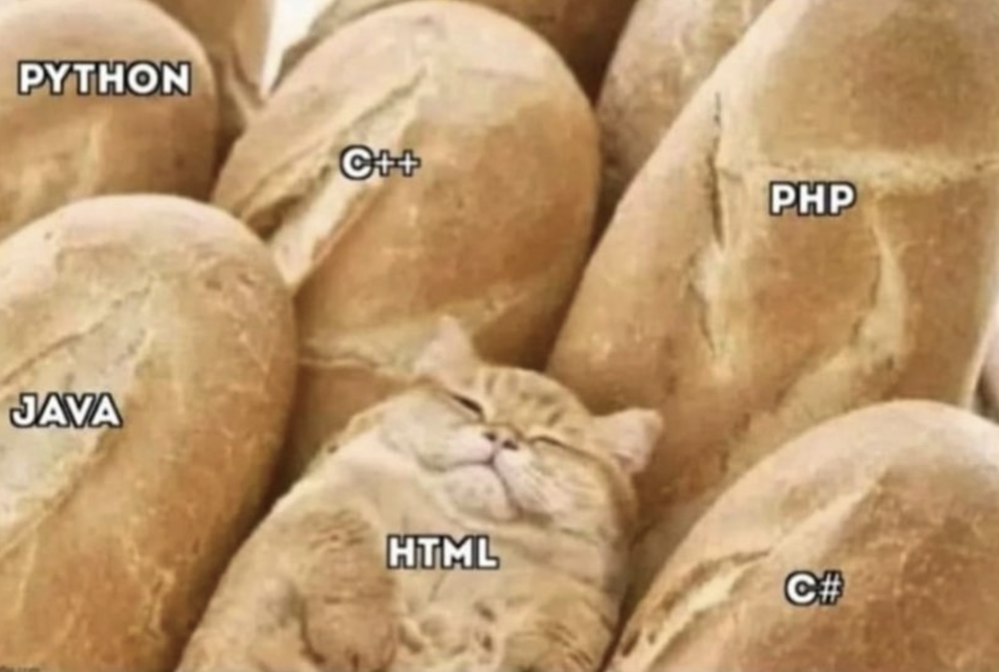

# <div align="center">Static Sites</div>

### Work done by <span style="color:#ECAD35">Sara Eilenstine</span>, course and media are through <a href="https://www.boot.dev/">Boot.dev</a>!

<br>

# HTML

The primary output of a static site generator is <a href="https://developer.mozilla.org/en-US/docs/Learn/Getting_started_with_the_web/HTML_basics">HTML (HyperText Markup Language)</a>, because HTML contains all the content of a web page.

HTML is a simple language for structuring content. It's not a _"programming" language_ in the sense that it doesn't have variables, loops, or conditionals.


HTML is a way to format text, images, links, and other media so that a web browser can render it in a <a href="https://en.wikipedia.org/wiki/Graphical_user_interface">GUI</a>. Here's a simple HTML file:

```html
<html>
<head>
    <title>Why Frontend Development Sucks</title>
</head>
<body>
    <h1>Front-end Development is the Worst</h1>
    <p>
        Look, front-end development is for script kiddies and soydevs who can't handle the real programming. I mean,
        it's just a bunch of divs and spans, right? And css??? It's like, "Oh, I want this to be red, but not thaaaaat
        red." What a joke.
    </p>
    <p>
        Real programmers code, not silly markup languages. They code on Arch Linux, not Mac OS, and certainly not
        Windows. They use Vim, not VS Code. They use C, not HTML. Come to the
        <a href="https://www.boot.dev">backend</a>, where the real programming
        happens.
    </p>
</body>
</html>
```

HTML is a tree-like structure where each "tag" (e.g. `<p>`, the bits enclosed in angle brackets) can contain other tags, and the whole thing is enclosed in an outermost `<html>` tag. Let's break down the structure of this HTML file:

- `<html>` is the root element of the document.
- `<head>` contains <a href="https://en.wikipedia.org/wiki/Metadata">metadata</a> about the document. Anything in the `<head>` is not rendered visibly in the browser window.
- `<title>` is the title of the document, which is displayed in the browser tab.
- `<body>` contains the content of the document, which is what is rendered in the browser window.
- `<h1>` is a top-level heading.
- `<p>` is a paragraph of text.
- `<a>` is a hyperlink. The href attribute is the URL the link points to. Attributes are key-value pairs that provide additional information about an element, like href="https://www.boot.dev".

# <span style="color:#0F77A5"><strong>Assignment</strong></span>

Create a new directory in your project called `public` and save the HTML above into a file called `index.html` in the `public` directory.

Next use Python's built-in <a href="https://docs.python.org/3/library/http.server.html">HTTP server</a> to serve the contents of the `public` directory:

```bash
cd public
python3 -m http.server 8888
```

Open your browser and paste in the URL of your server, (`http://localhost:8888` if you used port `8888` as suggested) into the address bar. You should see your file rendered as a web page! While the server is running, open a new terminal window. Run and submit the HTTP tests using the Boot.dev CLI tool. 

# <span style="color:#ECAD35">Solution</span>

```bash
cattelia@Amaterasu:~$ cd ~
cattelia@Amaterasu:~$ cd Github/Boot.dev/8-Static-Site-Generator/
cattelia@Amaterasu:~/Github/Boot.dev/8-Static-Site-Generator$ mkdir public
cattelia@Amaterasu:~/Github/Boot.dev/8-Static-Site-Generator$ ls
'1.1 HTML.md'   img   public
cattelia@Amaterasu:~/Github/Boot.dev/8-Static-Site-Generator$ cd public/
cattelia@Amaterasu:~/Github/Boot.dev/8-Static-Site-Generator/public$ touch index.html
cattelia@Amaterasu:~/Github/Boot.dev/8-Static-Site-Generator/public$ ls
index.html
cattelia@Amaterasu:~/Github/Boot.dev/8-Static-Site-Generator/public$ ls
index.html
cattelia@Amaterasu:~/Github/Boot.dev/8-Static-Site-Generator/public$ python -m http.server 8888
Serving HTTP on 0.0.0.0 port 8888 (http://0.0.0.0:8888/) ...
127.0.0.1 - - [31/Oct/2024 10:35:39] "GET / HTTP/1.1" 200 -
127.0.0.1 - - [31/Oct/2024 10:35:40] code 404, message File not found
127.0.0.1 - - [31/Oct/2024 10:35:40] "GET /favicon.ico HTTP/1.1" 404 -
```

# CSS

<a href="https://developer.mozilla.org/en-US/docs/Learn/Getting_started_with_the_web/CSS_basics">CSS (Cascading Style Sheets)</a> is another "not-really-a-programming-language" that styles <a href="https://developer.mozilla.org/en-US/docs/Web/HTML/Element">HTML elements</a>. It's a way to dress up your HTML with colors, fonts, responsive layouts, animations, etc.

```css
/* Make all <h1> HTML elements red */
h1 {
  color: red;
}
```
Or maybe we want the max-width of our paragraphs to be 50% of the screen width:
```css
/* Make all <p> HTML elements 50% of the screen width */
p {
  max-width: 50%;
}
```

# <span style="color:#0F77A5"><strong>Assignment</strong></span>

Copy and paste the following CSS into a file called `styles.css` in the `public` directory:
```css
body {
    font-family: Arial, sans-serif;
    line-height: 1.6;
    margin: 0;
    padding: 0;
    background-color: #1f1f23;
}
body {
    max-width: 600px;
    margin: 0 auto;
    padding: 20px;
}
h1 {
    color: #ffffff;
    margin-bottom: 20px;
}
p {
    color: #999999;
    margin-bottom: 20px;
}
a {
    color: #6568ff;
}
```

Then link the `styles.css` file in your `index.html` file by adding a `<link>` tag to the `<head>` section:

```html
<head>
    <title>Why Frontend Development Sucks</title>
    <link rel="stylesheet" href="styles.css">
</head>
```

You can kill your server with `Ctrl+C` and restart it:

```bash
# from inside the public directory
python3 -m http.server 8888
```
With the server running, run and submit the HTTP tests using the CLI tool.

## TIP

// _If you suspect that you're having caching issues, try clearing your browser cache and reloading this page._

# MARKDOWN

**Writing HTML by hand sucks**, you probably don't want to write entire documents in raw HTML.

Here's the other deal: **writing <a href="https://www.markdownguide.org/getting-started/">Markdown</a> is pure bliss.** Markdown is a less-verbose markup language designed for ease of writing. The trouble is web browsers don't understand Markdown. They only understand HTML and CSS. The #1 job of a static site generator is to convert Markdown into HTML

Instead of writing a verbose HTML list:
```html
<ul>
    <li>I really</li>
    <li>hate writing</li>
    <li>in raw html</li>
</ul>
```
You can write this in Markdown:

```md
* I really
* hate writing
* in raw html
```
This is the premise of our project - rather than writing all HTML, we will generate HTML from Markdown file instead to create a static site.

Our static site generator will take a directory of Markdown files (one for each web page), and build a directory of HTML files. Because we're not savages, we'll also include a single CSS file to style the site.

_**Fun fact #1:** This lesson, and every lesson on Boot.dev, is written in Markdown!_

_**Fun fact #2:** Discord, GitHub, and ChatGPT all support Markdown messages. When you use Markdown on those platforms it will render beautifully._

# CHEAT SHEET

This cheat sheet provides a quick reference for all the HTML and Markdown syntax you'll need to complete this project. Feel free to bookmark this page so you can come back to it as you work on this project.

- <a href="https://www.markdownguide.org/cheat-sheet/">MarkdownGuide.org</a>
- <a href="https://developer.mozilla.org/en-US/docs/Web/HTML/Element">HTML Element Referenec</a>

## HTML Headings
```html
<h1>Heading 1</h1>
<h2>Heading 2</h2>
<h3>Heading 3</h3>
<h4>Heading 4</h4>
<h5>Heading 5</h5>
<h6>Heading 6</h6>
```

## Markdown Headings
```md
# Heading 1
## Heading 2
### Heading 3
#### Heading 4
##### Heading 5
###### Heading 6
```

## HTML Paragraph
```html
<p>This is a paragraph of text.</p>0F77A5
```

## Markdown Paragraph
```md
This is a paragraph of text.
```

## HTML Bold
```html
<p>This is a <b>bold</b> word.</p>
```

## Markdown Bold
```md
This is a **bold** word.
```

## HTML Italics
```html
<p>This is an <i>italic</i> word.</p>
```

## Markdown Italics
```md
This is an *italic* word.
```

Note: some linting tools may autocorrect `*italic*` to `_italic_`, which is also markdown syntax for italics, but may trip you up during testing.

## HTML Links
```html
This is a paragraph with a <a href="https://www.google.com">link</a>.
```

## Markdown Links
```md
This is a paragraph with a [link](https://www.google.com).
```

## HTML Images
```html

```

## Markdown Images
```md

```

## HTML Unordered Lists
```html
<ul>
    <li>Item 1</li>
    <li>Item 2</li>
    <li>Item 3</li>
</ul>
```

## Markdown Unordered Lists
```md
* Item 1
* Item 2
* Item 3
```

## HTML Ordered Lists
```html
<ol>
    <li>Item 1</li>
    <li>Item 2</li>
    <li>Item 3</li>
</ol>
```

## Markdown Ordered Lists
```md
1. Item 1
2. Item 2
3. Item 3
```

## HTML Quotes
```html
<blockquote>
    This is a quote.
</blockquote>
```

## Markdown Quotes
```md
> This is a quote.
```

## HTML Code
```html
<code>This is code</code>
```

## Markdown Code
```md
    ```
    This is code
    ````
```

# Architecture


The flow of data through the full system is:

1. Markdown files are in the `/content` directory. A `template.html` file is in the root of the project.
2. The static site generator (the Python code in `src/`) reads the Markdown files and the template file.
3. The generator converts the Markdown files to a final HTML file for each page and writes them to the `/public` directory.
4. We start the built-in Python HTTP server (a separate program, unrelated to the generator) to serve the contents of the `/public` directory on `http://localhost:8888` (our local machine).
5. We open a browser and navigate to `http://localhost:8888` to view the rendered site.

## How the SSG works
The vast majority of our coding will happen in the `src/` directory because almost all of the work is done in steps 2 and 3 above. Here's a rough outline of what the final program will do when it runs:

1. Delete everything in the `/public` directory.
2. Copy any static assets (HTML template, images, CSS, etc.) to the `/public` directory.
3. Generate an HTML file for each Markdown file in the `/content` directory. For each Markdown file:
    1. Open the file and read its contents.
    2. Split the markdown into "blocks" (e.g. paragraphs, headings, lists, etc.).
    3. Convert each block into a tree of `HTMLNode` objects. For inline elements (like bold text, links, etc.) we will convert:
        - Raw markdown -> `TextNode` -> `HTMLNode`
4. Join all the `HTMLNode` blocks under one large parent `HTMLNode` for the pages.
5. Use a recursive `to_html()` method to convert the `HTMLNode` and all its nested nodes to a giant HTML string and inject it in the HTML template.
6. Write the full HTML string to a file for that page in the `/public` directory.

## How we're gonna build it
We're not going to build the program in the same order that it runs... that's often not the best way to build large projects. Instead, we'll tackle individual problems that we know we'll need to solve and use unit tests to make sure they work as expected. We'll put the pieces together into a working program as we get close to the end.

You don't need to memorize the information on this page, but come back to review it if you ever feel lost in the details.


### Work done by <span style="color:#ECAD35">Sara Eilenstine</span>, course and media are through <a href="https://www.boot.dev/">Boot.dev</a>!

<br>


| Input                          | Output                         |
| ------------------------------ | ------------------------------ |
| `# This is a heading`          | `This is a heading`            |
| `## This is also a heading`    | `This is also a heading`       |
| `This is not a heading`        | `This is not a heading`        |
| `* This is also not a heading` | `* This is also not a heading` |
