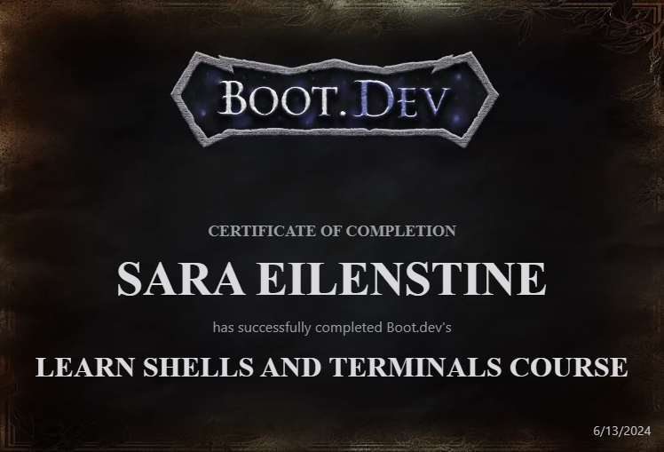
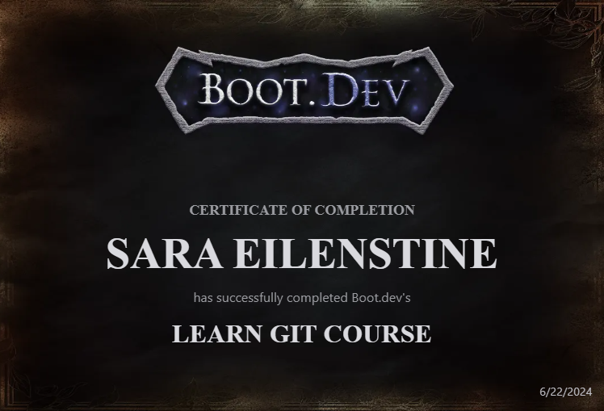
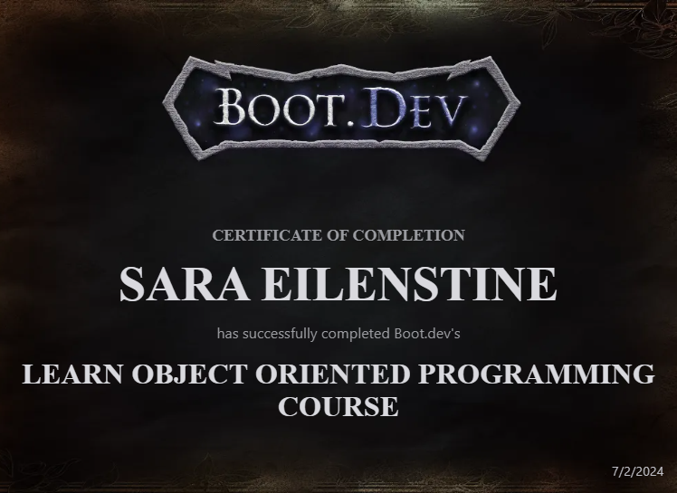

# Learning Backend Engineering from **Boot.dev**

### Or as they like to say, _**"Learn back-end development the addictive way"**_

## Sara's Boot.dev Public Profile - _<a href="https://www.boot.dev/u/cattelia"> > Check it out! < </a>_

You will find my heat map, achievements, Certificate of Completion, personal projects, and more.

# Progress Tracker

**Updated as of: 2024-07-02** 
_This and all other markdowns are optimized from Visual Studio Code Markdown visuals and not Git Markdown visuals_

| 1. Learn Python | 2. Learn Terminal & Shell | 3. Learn Git | 4. <a href="https://github.com/cattelia/bookbot">Build a Bookbot</a> |     5. Learn OOP     | 6. Learn Functional Programming |
| :-------------: | :-----------------------: | :----------: | :------------------------------------------------------------------: | :------------------: | :-----------------------------: |
|                 |                           |              |                     _**(Hyperlink to Project)**_                     |                      |                                 |
|  Introduction   |         Terminals         |    Setup     |                      Guide 1: Setup Local Files                      |       Classes        |     Functional Programming      |
|    Variables    |          Shells           | Repositories |                          Guide 2: Make Repo                          |    Encapsulation     |      First Class Functions      |
|    Functions    |       File Systems        |  Internals   |                         Guide 3: Clone Repo                          |     Abstraction      |         Pure Functions          |
|      Scope      |        Permissions        |    Config    |                       Guide 4: Install Python                        |     Inheritance      |           Recursions            |
|     Testing     |         Programs          |  Branching   |                       Guide 5: Running Python                        |     Polymorphism     |    Function Transformations     |
|    Computing    |         Packages          |    Merge     |                          Guide 6: Read File                          | Operator Overloading |            Closures             |
|   Comparisons   |                           |    Rebase    |                         Guide 7: Count Words                         |                      |                                 |
|      Loops      |                           |    Reset     |                      Guide 8: Count Characters                       |                      |                                 |
|      Lists      |                           |    Remote    |                        Guide 9: Print Report                         |                      |                                 |
|  Dictionaries   |                           |    GitHub    |                         Guide 10: Submit Bot                         |                      |                                 |
|      Sets       |                           |  GitIgnore   |                       Guide 11: Commit to Git                        |                      |                                 |
|     Errors      |                           |              |                                                                      |                      |                                 |
|   Challenges    |                           |              |                                                                      |                      |                                 |
|      Quiz       |                           |              |                                                                      |                      |                                 |

## At the beginning and end of each section you will see:

### _
 "All Solution work done by Sara Eilenstine. All **course work**, instruction and media are through <a href="https://www.boot.dev/">**Boot.dev**</a>!"
_

#### 
 All Solution work done by Sara Eilenstine.

`All of the solutions and projects will have been solved and curated by my own learning of the Boot.dev material, FreeCodeCamp or through my CS degree. As well as other subsidiary material found amoung the internets. I make a huge effort in adding resources that were instrumental to solving problems that were from outside of Boot.dev.`

#### 
 All **course work**, instruction and media are through <a href="https://www.boot.dev/">**Boot.dev**</a>!

`All of the questions, reading material, quizzes, pictures and Output files are curated by Boot.dev and their team. Including the photos you see in this Readme.md file.`

### **Key to Text Color**

While I wanted the colors to be cohesive to the general feel of the Markdown file and the media of Boot.dev, the colors also mean something.

| Pantone                                        |                      Color                       |                   Party Represented                    |
| :--------------------------------------------- | :----------------------------------------------: | :----------------------------------------------------: |
| **#ECAD35** |   **Gold**    | **Sara Eilenstine** |
| **#0F77A5** | **Dark Teal** |    **Boot.dev**     |

 

# How to move through my work:

## `x.y Title`  

`x` represents the Topic, which you can see that reflect in the table above on the left hand column.
`y` represents the Subtopics, which is the the right hand column with all the lessons to be taught.

| `x` First Course          | `y` Sub-Courses |
| :------------------------ | :-------------: |
| 1. Learn Python           |      1 - 5      |
| 2. Learn Terminal         |      1 - 4      |
| 3. Learn Git              |     1 - 10      |
| 4. Project Bookbot        |     1 - 11      |
| 4. Learn OOP              |      1 - 6      |
| 5. Functional Programming |      1 - 6      |

## File Name such as: `worldbanc` or `webflyx` and so on...

These files are the curated study material that Boot.dev had me work through to learn the basics and fundamentals of the languages or concepts that I was working on. They are located in the file that they were meant to be used for.

# My Certificates!

|                                   |                                                       |
| :-------------------------------: | :---------------------------------------------------: |
|      <h3>Learn Python </h3>       |          |
| <h3> Learn Shell & Terminal </h3> |  |
|       <h3> Learn Git </h3>        |                |
|       <h3> Learn OOP </h3>        |                |

 

